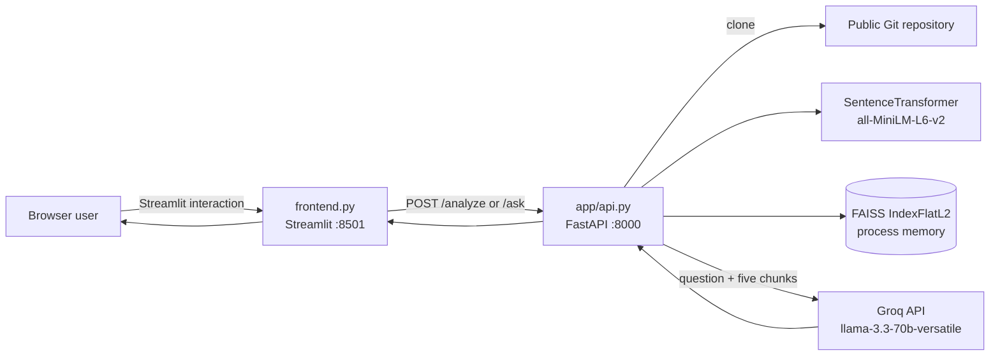
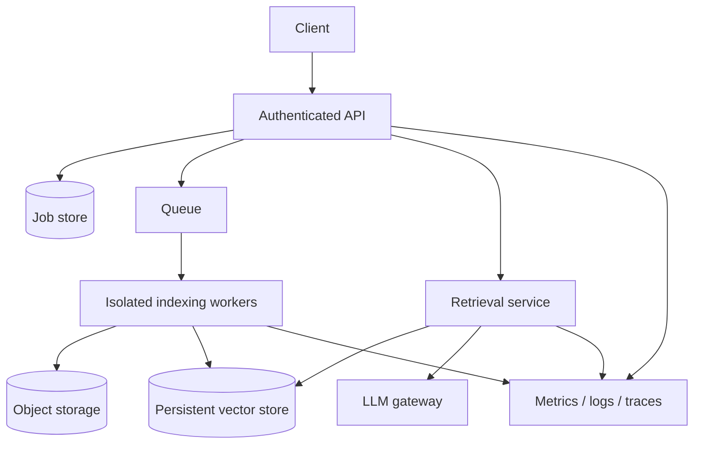

# Chapter 1 — Project Overview

## 1. Why this project exists

Reading an unfamiliar repository is expensive because names, dependencies, and behavior are distributed across files. Keyword search helps only when the developer already knows the vocabulary used by the author. This project explores a different workflow: clone a public GitHub repository, convert its source into searchable vectors, retrieve likely-relevant snippets for a natural-language question, and ask an LLM to explain those snippets.

The core value proposition is therefore **repository-grounded code exploration**, not autonomous code review and not a guarantee of correctness. Retrieval narrows the evidence sent to the model; it does not prove that the evidence is complete or that the generated answer is true.

### Problem statement

Given a public Git repository URL and a natural-language question:

1. acquire the repository;
2. discover supported source files;
3. split source text into bounded chunks;
4. embed and index those chunks;
5. retrieve the nearest chunks for the question;
6. produce an explanation using those chunks as context.

### Why RAG instead of sending the whole repository

LLM context windows are finite, large repositories are expensive to transmit, and irrelevant files dilute attention. Retrieval-Augmented Generation (RAG) pays an indexing cost once, then sends only a small subset of code for each question.

| Decision | Why it helps here | Cost introduced |
|---|---|---|
| Local embeddings | No embedding API key or per-query embedding fee | Model download, CPU/RAM use, generic rather than code-specialized embeddings |
| FAISS exact search | Minimal setup and deterministic nearest-neighbor search | In-memory, non-durable, linear scan for `IndexFlatL2` |
| Character chunks | Extremely simple and language-agnostic | Splits identifiers/functions and loses syntax boundaries |
| Hosted Groq LLM | Avoids running a 70B model locally | Network dependency, data disclosure, rate limits, external cost |
| Streamlit UI | Rapid demonstration with little frontend code | Weak separation of presentation/state and limited production control |
| FastAPI API | Typed request models and clear HTTP boundary | Current handlers still perform blocking work synchronously |

## 2. Implemented reality

The running system has two processes started by `run.sh`:

Arrow legend:

- `A --> B` means A initiates a synchronous call or passes data to B.
- `[(...)]` denotes stateful storage, but here it is only process memory.
- The arrow to Groq crosses the local trust boundary.

The `/analyze` endpoint executes the full clone-to-index pipeline in the request thread. It writes a clone under `data/<repo-name>`, stores only one active repository’s chunks/index/summary in the module-global `pipeline` dictionary, and returns summary metadata. `/ask` assumes that dictionary has already been populated.

The optional dependency graph is independent of retrieval. It parses only Python files with the standard `ast` module and records import strings keyed by **basename**, not full path. The frontend builds and renders its own NetworkX graph after analysis. The API also exposes `/architecture`, but the current frontend does not call that endpoint.

## 3. Proposed or implied architecture — not implemented

The README describes “layers,” a vector index, and an architecture-analysis capability. Those concepts exist, but the following production characteristics do **not**:

- no authentication or authorization;
- no per-user or per-repository tenant isolation;
- no job queue or background worker;
- no durable repository metadata database;
- no persistent FAISS serialization;
- no MongoDB, PostgreSQL, Redis, object storage, or cache;
- no Dockerfile, Compose file, Kubernetes manifest, or Cloud Run configuration;
- no retry, timeout, circuit breaker, rate limiter, or quota;
- no observability stack, structured logging, tracing, or metrics;
- no test suite or CI configuration;
- no incremental indexing, branch/commit selection, webhook refresh, or deletion lifecycle;
- no source citations in a structured API response;
- no reranker, hybrid lexical search, or retrieval evaluation;
- no sandbox around cloned repository contents.

A plausible production evolution would be:

This is a recommendation, **not a description of the repository**.

## 4. End-to-end behavior

### Indexing path

1. User enters a URL in Streamlit and clicks **Analyze Repository**.
2. `requests.post` sends `{"repo_url": ...}` to `POST /analyze`.
3. Pydantic constructs `RepoRequest`.
4. `clone_repository` derives a repository name from the final URL segment.
5. If `data/<name>` exists, it is reused without fetching updates or verifying origin.
6. `load_code_files` recursively reads `.py`, `.js`, `.ts`, `.java`, `.cpp`, and `.c`.
7. `chunk_code` slices each file every 500 Python characters.
8. `embed_chunks` encodes all chunk strings in one call.
9. `build_index` creates `faiss.IndexFlatL2` and adds all vectors.
10. Chunks and index replace any previous values in the global `pipeline`.
11. `generate_repo_summary` walks every filesystem entry and reports languages/modules.
12. The frontend reconstructs `data/<last-url-segment>` and separately builds an AST import graph.

### Question path

1. User enters a question and clicks **Ask AI**.
2. Streamlit posts `{"question": ...}` to `POST /ask`.
3. `embed_query` returns a two-dimensional array with one vector.
4. FAISS returns five nearest vector IDs and squared L2 distances.
5. `retrieve` maps IDs to the corresponding chunk dictionaries; distances are discarded.
6. `generate_answer` concatenates file paths and chunk text into a prompt.
7. Groq generates an answer at temperature `0.2`.
8. FastAPI returns `{"answer": ...}` and Streamlit injects it into an HTML container.

## 5. Domain model and invariants

There is no formal domain layer. Runtime data uses dictionaries:

| Concept | Actual representation | Required invariant |
|---|---|---|
| Code file | `{"file_path": str, "content": str}` | UTF-8 read succeeded |
| Code chunk | `{"file_path": str, "chunk": str}` | Chunk order matches embedding/index row order |
| Embeddings | NumPy-like 2-D array | At least one row; fixed dimension |
| Vector index | `faiss.IndexFlatL2` | Index rows correspond exactly to `pipeline["chunks"]` |
| Pipeline state | module-global dictionary | `"index"` and `"chunks"` must exist before `/ask` |
| Summary | dictionary | Frontend assumes four exact keys |
| Dependency graph | `dict[str, list[str]]` | Keys may collide because they are basenames |

The most important hidden invariant is positional alignment: vector row `i` must describe `chunks[i]`. No explicit ID object enforces this.

## 6. Complexity and scalability

Let:

- `F` = number of discovered source files;
- `B` = total decoded source characters;
- `C = ceil(B / 500)` approximately = number of chunks;
- `D` = embedding dimension (384 for typical MiniLM output);
- `K` = requested neighbors (default 5).

| Stage | Time | Space | Scaling concern |
|---|---:|---:|---|
| Clone | `O(repository bytes)` | same on disk | Network and unbounded repository size |
| Walk/read | `O(B)` | `O(B)` | All file contents retained before chunking |
| Chunk | `O(B)` copying | `O(B)` | Python strings duplicate content |
| Embed | model-dependent, roughly `O(C × tokens)` | `O(CD)` | One unbounded batch can exhaust memory |
| FAISS build | `O(CD)` | `O(CD)` | Entire index resides in one process |
| Exact query | `O(CD)` | `O(K)` result | Latency grows linearly with chunks |
| Prompt creation | `O(total retrieved text)` | same | No token-budget enforcement |

For a demo repository this simplicity is valuable. For millions of chunks, exact flat search and one-process storage are inappropriate; approximate indexes, sharding, persistence, batching, and asynchronous jobs become necessary.

## 7. Strengths

- The dataflow is easy to teach and inspect.
- Each pipeline stage is a small module with one responsibility.
- Exact FAISS search avoids approximation errors.
- Pydantic rejects structurally invalid API bodies.
- Local embeddings reduce external data transfer during indexing.
- The import graph uses Python’s parser rather than regular expressions.
- The UI demonstrates indexing, summary, retrieval, generation, and graphing in one workflow.

## 8. Disadvantages and failure modes

### Correctness

- Character chunks can cut through a function, comment, string, or multibyte conceptual token.
- `all-MiniLM-L6-v2` is a general sentence model; source-code semantics may be weak.
- Raw L2 distance is used without normalization or similarity calibration.
- Only five chunks are retrieved, regardless of question breadth.
- Retrieval distances are ignored, so low-confidence results still reach the LLM.
- “No hallucinations” in UI copy is false: prompting does not constrain the model to extractive answers.
- No source-line metadata or commit SHA allows reproducible citations.

### Reliability

- `/ask` before `/analyze` raises a `KeyError`, normally producing HTTP 500.
- Empty or unsupported repositories lead to `embeddings[0]` failure.
- If FAISS returns `-1` when `K` exceeds available vectors, Python indexes the last chunk, causing duplicates/wrong results.
- Bare `except:` blocks suppress parse/read failures and even interrupts.
- Existing clones are stale and can be the wrong origin if two URLs share a final name.
- A backend reload loses the index but leaves cloned files, creating confusing partial state.
- The shell script backgrounds only Uvicorn; process shutdown and failure propagation are unmanaged.

### Security and privacy

- Arbitrary URLs reach GitPython with no allowlist or scheme validation.
- Repository names are derived from user input and are not normalized as trusted identifiers.
- Clone size, file count, and file size are unlimited: disk/RAM/CPU denial of service is possible.
- Symlink and special-file behavior is not intentionally controlled.
- Source code is sent to Groq; this is unsuitable for confidential repositories without policy and consent.
- The Streamlit answer is inserted with `unsafe_allow_html=True`; model-generated HTML can affect the page.
- API has no authentication, CSRF strategy, or rate limit.

### Concurrency

The global dictionary is shared by all requests in one process. Two users analyzing different repositories race to overwrite it. An `/ask` can combine one repository’s chunks with another repository’s index if mutation occurs between assignments. Multiple Uvicorn workers would each have independent state, so requests routed to different workers would fail inconsistently.

## 9. When to use and when not to use

### Good fit

- portfolio or interview demonstration of a RAG pipeline;
- teaching embeddings and vector retrieval;
- local exploration of small, public repositories;
- prototype used by one trusted operator;
- baseline for retrieval experiments.

### Do not use as-is

- private or regulated code;
- untrusted multi-tenant public service;
- repositories too large to embed in one batch;
- compliance-sensitive decisions or security audits;
- questions requiring whole-program correctness;
- real-time analysis of frequently changing branches;
- workflows requiring durable indexes, citations, or audit logs.

### Alternatives

| Need | Better alternative | Tradeoff |
|---|---|---|
| Exact symbol lookup | ripgrep, IDE index, language server | Less natural-language tolerance |
| Structural code understanding | Tree-sitter/AST chunks + call graph | Language-specific complexity |
| Large-scale semantic retrieval | Qdrant/Milvus/pgvector/Pinecone | Operational cost and distributed failure modes |
| Repository-wide reasoning | Hierarchical summaries + map-reduce | More LLM calls and summary drift |
| Guaranteed factual output | Extractive response with citations/abstention | Less fluent answers |
| Rapid local prototype | Current implementation | Limited scale and safety |

## 10. Production-readiness checklist

- Validate URL scheme/host and pin a commit SHA.
- Clone in an isolated worker with disk, network, CPU, memory, and time limits.
- Use random internal repository IDs rather than URL-derived directories.
- Respect ignore rules and cap file count/size; detect binary/generated/vendor files.
- Chunk by syntax with overlap and line/symbol metadata.
- Batch embeddings and persist model/version/config metadata.
- Persist vectors and metadata atomically under a repository/version key.
- Add lexical + semantic hybrid retrieval, deduplication, reranking, thresholds, and abstention.
- Enforce prompt token budgets and treat repository text as untrusted prompt input.
- Return citations and retrieval diagnostics.
- Add auth, tenant checks, rate limits, encryption, retention, and deletion.
- Add request timeouts, retries only where safe, idempotency, health checks, and graceful shutdown.
- Add unit/integration/evaluation tests plus logs, traces, metrics, and cost monitoring.

## 11. Interview handbook

### Beginner

**Question:** What problem does this application solve?

**Ideal Answer:** It reduces the cost of exploring an unfamiliar public repository. It clones supported source files, indexes character chunks with local embeddings in FAISS, retrieves five chunks for a question, and sends those chunks to a Groq-hosted LLM. It is a repository-grounded assistant prototype, not a correctness guarantee.

**Why interviewer asked it:** To test whether the candidate can state product value while distinguishing it from implementation marketing.

**Common mistakes:** Saying it “understands any codebase,” calling FAISS a durable database, or claiming RAG eliminates hallucinations.

**Follow-up questions:** Which repository types are supported? What happens before the first analysis? Which data leaves the machine?

### Intermediate

**Question:** Why use RAG here rather than fine-tuning the LLM?

**Ideal Answer:** Repository content changes and must be attributable to a specific version. RAG can refresh an index without retraining and supplies source evidence at query time. Fine-tuning is better for behavior/style or repeated domain patterns, not as a mutable fact store. RAG still needs good chunking, retrieval evaluation, citations, and abstention.

**Why interviewer asked it:** To check whether the candidate understands the different jobs of retrieval and model adaptation.

**Common mistakes:** Treating fine-tuning as a database, assuming RAG is always cheaper, or ignoring indexing latency.

**Follow-up questions:** When would fine-tuning complement RAG? How would you evaluate retrieval independently?

### Advanced

**Question:** Identify the most dangerous state-management flaw.

**Ideal Answer:** The module-global `pipeline` is an unkeyed, mutable singleton. All users share one active index; concurrent analyses can overwrite state, multiple workers diverge, and restarts erase it. The fix is not merely a lock: model repository/version/tenant IDs, build immutable index versions, persist them atomically, and resolve each query to an authorized version.

**Why interviewer asked it:** To test concurrency, deployment, and data-model reasoning beyond the happy path.

**Common mistakes:** Suggesting only a global mutex, overlooking multiple processes, or failing to discuss tenant isolation.

**Follow-up questions:** How would atomic publication work? How would old versions be garbage-collected?

### FAANG

**Question:** Design this for 10 million repositories and 100,000 queries per second.

**Ideal Answer:** Separate control and data planes. Use authenticated APIs, durable job metadata, event queues, isolated clone/index workers, content-addressed source storage, deduplicated syntax-aware chunks, batched embedding services, sharded approximate vector indexes, lexical indexes, rerankers, and an LLM gateway. Partition by repository/version and perhaps language; cache authorized query results; apply backpressure and per-tenant quotas. Define SLOs, regional/privacy boundaries, evaluation metrics, index-version rollouts, disaster recovery, and cost controls. Exact details depend on average repository/chunk size and freshness targets.

**Why interviewer asked it:** To assess requirements discovery, decomposition, capacity reasoning, and consistency tradeoffs.

**Common mistakes:** Naming cloud products without sizing, ignoring ingestion bursts and deletions, or assuming one global vector index.

**Follow-up questions:** Estimate vector storage. How would you handle embedding-model migration? What consistency does query-after-index require?

### Follow-up

**Question:** How would you prove answers are grounded?

**Ideal Answer:** Store commit SHA, relative path, line range, symbol, chunk hash, and retrieval score with every vector. Return citations, verify cited spans still match the indexed hash, instruct the model to abstain when evidence is insufficient, and measure citation precision/recall plus faithfulness on a labeled benchmark. Prompting alone is not proof.

**Why interviewer asked it:** To see whether the candidate turns an AI claim into measurable system behavior.

**Common mistakes:** Using only user ratings, equating nearest-neighbor score with factuality, or hiding retrieved evidence.

**Follow-up questions:** How would you detect unsupported clauses? What thresholds would trigger abstention?

### Trick

**Question:** Does the current system analyze “any public GitHub repository” as the README claims?

**Ideal Answer:** No. It can clone many Git-compatible public URLs, but indexing only reads six filename extensions. Architecture analysis only parses Python. Binary, unsupported, generated, malformed UTF-8, and files that raise read errors are silently skipped. URL handling is not GitHub-specific or validated, and very large repositories can exhaust resources.

**Why interviewer asked it:** To test whether the candidate checks claims against code rather than repeating documentation.

**Common mistakes:** Answering “yes” because GitPython can clone it, or answering “Python only” despite six parser extensions.

**Follow-up questions:** How should capability be described accurately? Which tests would define the support contract?
