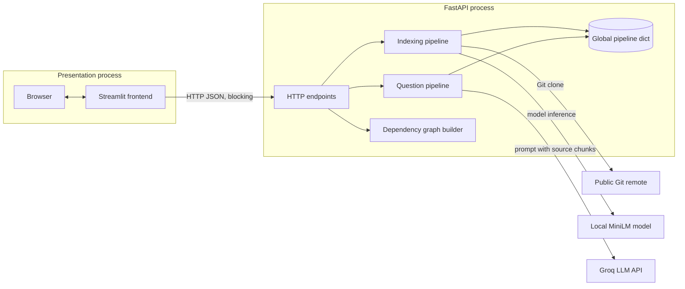
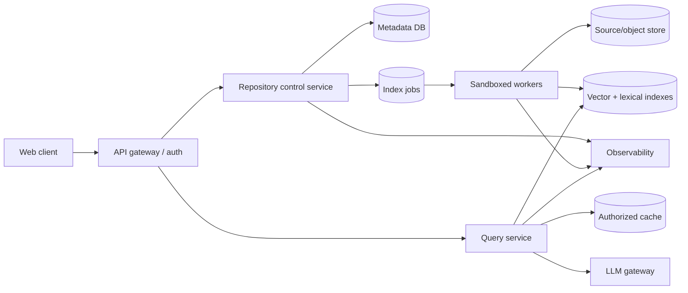
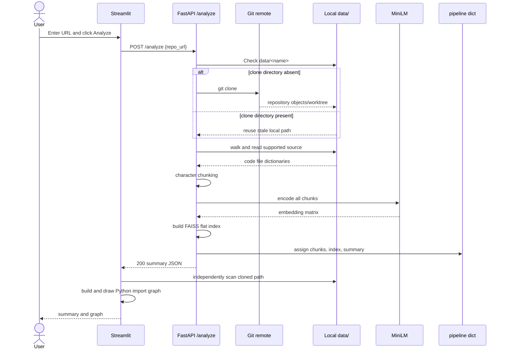
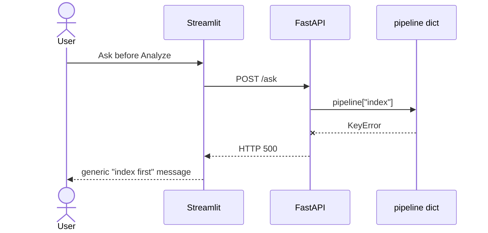
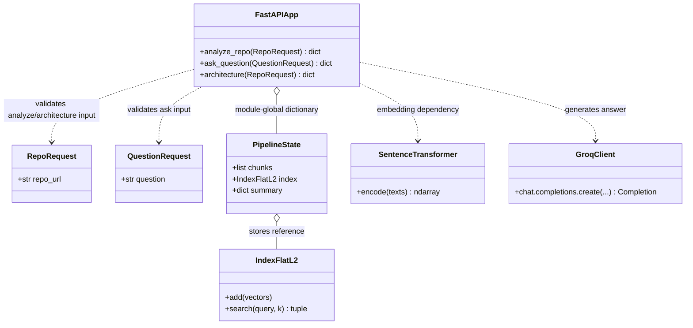
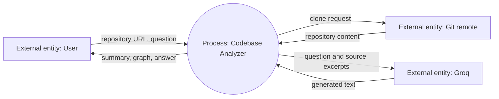
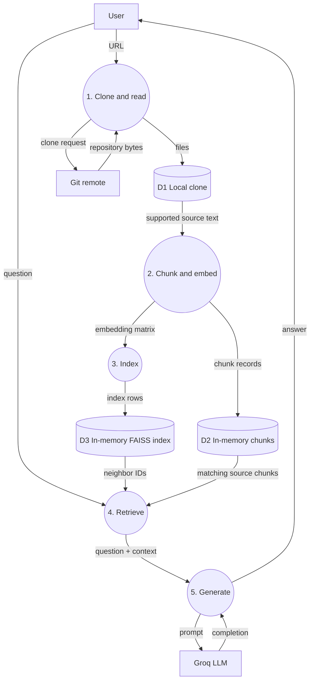
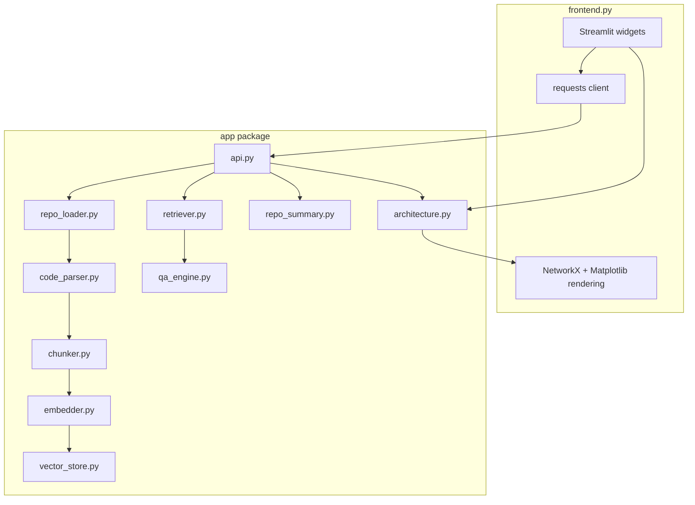
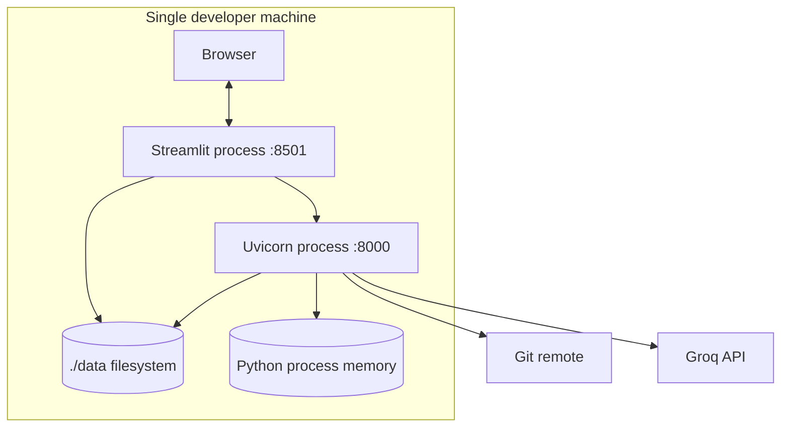

# Chapter 2 — System Design

## 1. Design from the reason outward

The project needs to transform an expensive, repository-wide search problem into a small-context question-answering problem. Its design therefore has two distinct flows:

1. **write/index flow:** source repository → chunks → embeddings → vector index;
2. **read/query flow:** question → embedding → nearest chunks → generated answer.

Separating these conceptually matters because indexing is slow, resource-heavy, and version-sensitive, while querying should be low latency and read-only. The current code separates them into endpoints but stores both flows in one process-global dictionary. This is adequate for a single-user demo and is the main boundary that breaks under production load.

## 2. Diagram notation and arrow semantics

Diagrams are easy to misread unless arrow meaning is explicit.

| Notation | Meaning in this chapter |
|---|---|
| `A --> B` | A initiates a call or sends data/control to B |
| `A -.-> B` | Optional, indirect, or proposed interaction |
| `A <--> B` | Bidirectional protocol; not simultaneous execution |
| `A -- label --> B` | The label names the payload or operation |
| `A *-- B` | Composition: A owns B’s lifecycle |
| `A o-- B` | Aggregation: A references B but does not necessarily own it |
| `A ..> B` | Dependency: A uses B |
| `A <|-- B` | Inheritance/generalization |
| `[(Store)]` | State-bearing store |
| `[Process]` | Executing component/process |

An arrow does **not** automatically mean asynchronous behavior. In the implemented system, almost every call shown is synchronous and blocking.

## 3. High-Level Design (HLD)

### 3.1 Implemented HLD



Why these boundaries:

- Streamlit and FastAPI demonstrate a real client/server boundary while remaining Python-only.
- Embeddings run locally because a compact transformer is feasible on a developer machine.
- Generation is external because a 70B model is not feasible for most laptops.
- FAISS is embedded inside the API process to avoid operating a separate vector service.

What the boundary costs:

- two local processes and a hard-coded URL;
- serialized HTTP despite both components being Python;
- duplicated architecture work in the frontend;
- backend state that cannot be shared across workers;
- blocking network/model work inside request handlers.

### 3.2 Proposed production HLD — NOT implemented



This design is proposed because production ingestion must be asynchronous, durable, isolated, and independently scalable. None of the gateway, database, queue, worker, object store, cache, or LLM gateway exists in this repository.

## 4. Low-Level Design (LLD)

### 4.1 Implemented indexing pipeline

```text
POST /analyze(RepoRequest)
  |
  +-- clone_repository(url) ---------> data/<derived-name>
  |
  +-- load_code_files(path) --------> list[{file_path, content}]
  |
  +-- chunk_code(files, 500) --------> list[{file_path, chunk}]
  |
  +-- embed_chunks(chunks) ----------> matrix[C, D]
  |
  +-- build_index(matrix) -----------> FAISS IndexFlatL2
  |
  +-- pipeline["chunks"/"index"] ----> shared mutable process memory
  |
  +-- generate_repo_summary(...) ---> dict
  |
  `-- HTTP 200 JSON
```

Design details and hidden contracts:

- The URL’s final slash-separated part becomes a directory name after removing every `.git` substring.
- Existing path means “already cloned”; freshness and remote identity are not checked.
- `load_code_files` reads complete files before chunking.
- 500 is a character count, not bytes or tokens.
- `model.encode` output row order must remain identical to chunk list order.
- `IndexFlatL2` stores vectors without training and performs exact squared-Euclidean search.
- State publication is not atomic as a pair: chunks and index are assigned separately.
- Summary file count includes all files, not merely indexed source files.

### 4.2 Implemented question pipeline

```text
POST /ask(QuestionRequest)
  |
  +-- embed_query(question) ----------> matrix[1, D]
  |
  +-- pipeline["index"].search(...,5)
  |                                    -> distances[1,5], ids[1,5]
  +-- map ids to pipeline["chunks"] --> five dictionaries
  |
  +-- construct prompt --------------> unescaped repository text + question
  |
  +-- Groq chat completion ----------> generated text
  |
  `-- HTTP 200 {"answer": text}
```

The question is embedded as a one-item list so FAISS receives the required two-dimensional query matrix. Distances are computed but discarded. No check ensures IDs are valid, results exceed a relevance threshold, or context fits the model’s token window.

### 4.3 API contracts

| Endpoint | Input | Success output | Side effect | Current missing error contract |
|---|---|---|---|---|
| `POST /analyze` | `{"repo_url": str}` | message, chunk count, summary | clone and overwrite global pipeline | clone/read/model/index failures |
| `POST /ask` | `{"question": str}` | `{"answer": str}` | external LLM call | not indexed, rate limit, no evidence |
| `POST /architecture` | `{"repo_url": str}` | import graph dict | clone/reuse repository | malformed Python silently skipped |

Pydantic checks only that fields are strings. Empty values and unsafe URLs remain valid.

## 5. Sequence diagrams

### 5.1 Analyze sequence



Arrow explanation:

- Solid `->>` arrows are synchronous requests/calls.
- Dashed `-->>` arrows are returns or responses.
- The `alt` block shows mutually exclusive paths.
- `API->>API` is in-process computation, not HTTP.
- Streamlit’s direct filesystem scan means the UI and backend must share the same working directory/filesystem.

### 5.2 Ask sequence

```mermaid
sequenceDiagram
    actor User
    participant UI as Streamlit
    participant API as FastAPI /ask
    participant Model as MiniLM
    participant Index as FAISS
    participant Groq as Groq API

    User->>UI: Enter question
    UI->>API: POST /ask {question}
    API->>Model: encode([question])
    Model-->>API: one query vector
    API->>Index: search(vector, top_k=5)
    Index-->>API: distances and row IDs
    API->>API: map IDs; build prompt
    API->>Groq: chat.completions.create
    Groq-->>API: generated completion
    API-->>UI: {"answer": text}
    UI-->>User: unsafe HTML-rendered answer
```

No arrow exists from Groq back to source files: the model cannot independently validate context.

### 5.3 Error sequence that is currently implicit



`--x` means failure/exception rather than a normal return.

## 6. Class diagram

The code is mostly procedural; only request DTOs are project-defined classes.



Arrow explanation:

- `..>` means “uses”; there is no inheritance.
- `o--` means an aggregate/reference. `PipelineState` is conceptual documentation for a plain dict, not an implemented class.
- Public method notation describes endpoint behavior, not actual methods on the FastAPI object.

### Proposed class boundaries — NOT implemented

A production refactor might introduce immutable `RepositoryVersion`, `Chunk`, `Citation`, `IndexManifest`, and service interfaces (`RepositorySource`, `Embedder`, `VectorIndex`, `Generator`). This would make contracts testable and allow replacement implementations. It would also add abstraction overhead that is unnecessary for the current ~100 lines of backend logic.

## 7. Data Flow Diagrams (DFD)

### 7.1 Context DFD (Level 0)



In a DFD, arrows represent **data**, not call direction or control flow. The repository excerpts crossing to Groq are the critical privacy flow.

### 7.2 Level 1 DFD



The DFD reveals an important fact hidden by a component diagram: FAISS stores vectors but not source metadata; D2 must remain aligned with D3.

## 8. Component diagram



Arrows mean compile/import-time dependency plus runtime calls where applicable. The apparent `RL --> CP` chain is orchestrated by `api.py`; these modules do not import one another. A stricter UML component graph would draw every utility directly from `api.py`.

### Component cohesion and coupling

| Component | Cohesion | Coupling concern |
|---|---|---|
| Repository loader | Good: clone/reuse only | URL-to-path and freshness policy embedded together |
| Parser | Good: extension-filtered reads | Bare exceptions and no metadata |
| Chunker | Good: segmentation only | Assumes dictionary schema |
| Embedder | Good: vectorization | Model loads at import time; concrete global |
| Vector store | Good: index construction | Hard-coded FAISS metric/type |
| Retriever | Good: mapping neighbors | Trusts FAISS IDs and positional alignment |
| QA engine | Mixed: prompt + provider call | Global client and hard-coded model/prompt |
| Summary | Good: filesystem summary | Semantics differ from indexed corpus |
| Architecture | Mixed: extraction + visualization | Heavy plotting imports in backend module |
| API | Orchestrator | Owns global state and synchronous lifecycle |
| Frontend | Low cohesion | UI, CSS, HTTP, path logic, graph analysis/rendering |

## 9. Deployment diagram

### Current local deployment



The shared local filesystem is an undocumented deployment requirement because the frontend derives the clone path and scans it directly.

### Scaling failure

Adding replicas behind a load balancer does not work:

```text
             /--> API replica A -- memory index A
Load balancer
             \--> API replica B -- empty/different index B
```

Sticky sessions reduce symptoms but do not provide durability, safe deployments, or cross-process consistency.

## 10. Key design tradeoffs and alternatives

### Synchronous versus asynchronous indexing

Current synchronous indexing is easy to reason about and immediately returns either success or failure. It ties up a request for clone/model duration, risks proxy timeouts, and provides no progress/resume. A queue and worker are appropriate when indexing exceeds request SLOs; they are unnecessary overhead for a local demo.

### Exact versus approximate search

`IndexFlatL2` has perfect recall for the chosen metric and no training step. Query work is `O(CD)`. HNSW/IVF/PQ can lower latency/memory at scale but introduce build parameters, approximation, and harder operations. Do not adopt ANN before corpus size and latency measurements justify it.

### Global model versus injected service

Loading MiniLM once at import avoids repeated initialization. It increases startup time, complicates tests, and each process duplicates model memory. Dependency injection supports mocking and model switching but can obscure a tiny pipeline.

### Local clone versus Git provider API

Git clone preserves full worktree semantics and supports many providers. It downloads history by default and executes complex protocol parsing. A shallow, commit-pinned clone or provider archive can reduce cost; provider APIs add vendor coupling and rate limits.

### Character versus syntax-aware chunks

Character chunks cover multiple languages with no parser dependencies. Syntax-aware chunks preserve symbols and line boundaries, making citations and retrieval better. They require language grammars and policies for very large functions. A hybrid fallback is usually best.

## 11. Edge cases by subsystem

| Subsystem | Edge case | Current behavior | Desired behavior |
|---|---|---|---|
| URL | trailing slash | repository name becomes empty | canonicalize and validate |
| Clone | same name, different owners | reuses wrong directory | content-address by provider/owner/repo/SHA |
| Clone | private/auth repository | clone exception → 500 | authorized connector and safe error |
| Parser | non-UTF-8 file | silently skipped | detect encoding/report skip |
| Parser | huge generated file | fully loaded/chunked | size cap and ignore policy |
| Chunker | empty corpus | empty embedding then index crash | return explicit “no supported source” |
| Index | fewer than five chunks | possible `-1` IDs | `k=min(k, ntotal)` and validate |
| Query | blank string | embedded and sent | validation error |
| Query | prompt injection in source | passed as instructions-like text | delimit/untrusted-data policy |
| Graph | duplicate basenames | graph entry overwritten | use normalized relative paths |
| Graph | relative imports | module strings incomplete | resolve package context |
| UI | backend unavailable | request exception can crash script | timeout/catch/actionable state |

## 12. Production system qualities

### Availability

Decouple indexing from query serving. Publish immutable index versions only after all vectors and metadata are complete. Keep the previous version available during rebuild.

### Consistency

Define query-after-index semantics. Strong read-after-publish can be achieved by returning a version ID and routing queries to that manifest. Eventual consistency is acceptable only if surfaced to users.

### Security

Assume repository files are hostile data. Isolate cloning, disable unintended credentials, restrict egress, cap resources, avoid executing code, and defend the LLM prompt from source-borne instructions. Authenticate every repository/version lookup.

### Observability

Measure clone duration/bytes, files accepted/skipped, chunks, embedding throughput, index size/build latency, retrieval score distributions, LLM tokens/cost/latency, failures by stage, and end-to-end SLOs. Include repository/version IDs but avoid logging source.

### Testing

- unit tests for URL naming, extension filtering, chunk boundaries, and neighbor mapping;
- contract tests for all endpoint status/error schemas;
- integration tests with temporary repositories and fake embedding/LLM clients;
- concurrency tests for simultaneous analyze/query;
- retrieval benchmark with known question-to-symbol relevance;
- adversarial tests for prompt injection, oversized repos, malformed encodings, and HTML output.

## 13. Interview handbook

### Beginner

**Question:** What is the difference between the indexing and query flows?

**Ideal Answer:** Indexing clones and reads a repository, creates chunks and embeddings, then builds FAISS state. Querying embeds only the question, searches existing state, and sends retrieved code to Groq. Indexing is a write-like, expensive operation; query is a read-like operation but currently still calls an external generator.

**Why interviewer asked it:** To verify basic decomposition and dataflow understanding.

**Common mistakes:** Saying the LLM creates embeddings, claiming FAISS stores the files, or missing that `/ask` depends on prior `/analyze`.

**Follow-up questions:** Which flow should be asynchronous? Which state connects them?

### Intermediate

**Question:** Explain the arrows in the ask sequence diagram.

**Ideal Answer:** Solid arrows indicate synchronous invocation/data transfer, dashed arrows indicate returns, and self-arrows indicate in-process computation. UI-to-API and API-to-Groq cross process/network boundaries; API-to-FAISS is an in-process library call. None denotes a queue or event.

**Why interviewer asked it:** To ensure diagrams communicate runtime semantics rather than just boxes.

**Common mistakes:** Assuming every arrow is asynchronous or treating a return arrow as a second independent request.

**Follow-up questions:** How would the diagram change with a job queue? Where are trust boundaries?

### Advanced

**Question:** How would you atomically publish a new repository index?

**Ideal Answer:** Build chunks, vectors, and metadata under a unique immutable version. Validate row counts/checksums and write a manifest last. In a transaction or compare-and-swap, update the repository’s active-version pointer. Queries resolve that pointer once per request. Failed builds remain unreachable and are later garbage-collected.

**Why interviewer asked it:** To test consistency reasoning and prevention of mixed-version reads.

**Common mistakes:** Overwriting index and chunk files in place, using only a mutex, or ignoring rollback.

**Follow-up questions:** How do you migrate embedding dimensions? How do long queries pin a version?

### FAANG

**Question:** Design the multi-region query path and state your consistency model.

**Ideal Answer:** Replicate immutable index shards and manifests regionally; route users to a nearby authorized query service. Repository active-version metadata can use a globally consistent pointer or eventually replicated pointers, depending freshness SLO. A version ID returned by ingestion enables monotonic/read-your-writes routing. LLM gateways enforce regional data policy. Track replication lag, fall back only to explicitly acceptable older versions, and never mix chunk metadata from another version.

**Why interviewer asked it:** To assess whether the candidate can connect distributed consistency, locality, privacy, and failure handling.

**Common mistakes:** Claiming active-active is automatically strongly consistent or ignoring embedding/index version compatibility.

**Follow-up questions:** What happens during regional partition? How are deletions propagated?

### Follow-up

**Question:** Why is a component diagram insufficient to describe this system?

**Ideal Answer:** It shows dependencies but not temporal ordering, data transformations, storage ownership, deployment boundaries, or alternate/error paths. Sequence diagrams expose order, DFDs expose sensitive data movement, deployment diagrams expose shared-memory/shared-filesystem constraints, and class diagrams expose type relationships.

**Why interviewer asked it:** To test selecting the right modeling tool.

**Common mistakes:** Treating all diagrams as interchangeable or drawing implementation classes in an HLD only.

**Follow-up questions:** Which diagram best reveals the positional vector/chunk invariant? Which best shows failure before indexing?

### Trick

**Question:** Can we scale the current backend by running `uvicorn --workers 4`?

**Ideal Answer:** It can start four workers, but functionality becomes nondeterministic because each process has its own `pipeline` and MiniLM instance. `/analyze` populates only the handling worker; `/ask` may hit another. Memory use also multiplies. Shared persistent/versioned state is required before horizontal scaling.

**Why interviewer asked it:** To catch the assumption that stateless HTTP automatically means a stateless application.

**Common mistakes:** Recommending sticky sessions as the complete fix or overlooking model-memory duplication.

**Follow-up questions:** What is the smallest correct single-host improvement? What becomes the next bottleneck?
