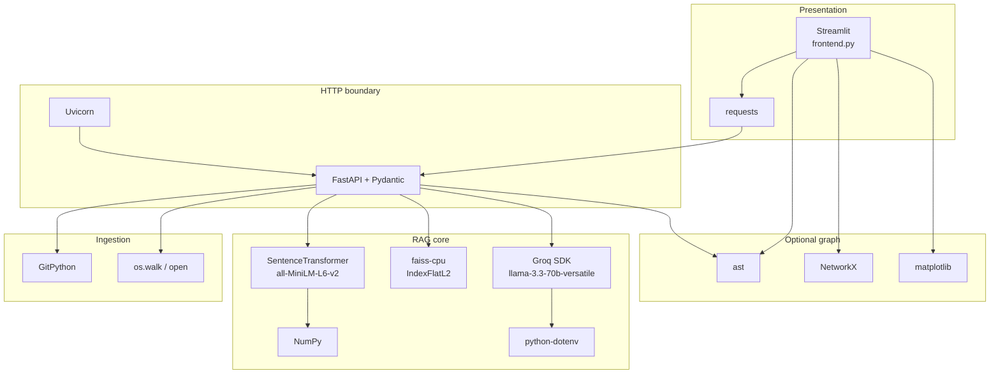

# Chapter 3 — Tech Stack

## Scope and honesty standard

This chapter explains every dependency listed in `requirements.txt` and the major Python standard-library modules used by the application. Claims about **what the project uses** are grounded in the repository. Claims about **production alternatives** are labeled as recommendations that are **not implemented**.

Actual declared dependencies:

```
fastapi
uvicorn
streamlit
requests
gitpython
sentence-transformers
faiss-cpu
numpy
groq
python-dotenv
networkx
matplotlib
```

There is **no** MongoDB, Redis, PostgreSQL, Docker, authentication library, ORM, job queue, or test framework in this project.



---

## 1. Why the stack looks like this

The project is a **single-operator RAG demonstration**. The stack therefore optimizes for:

| Priority | Consequence in stack |
|---|---|
| Fast to build in Python | Streamlit + FastAPI + GitPython |
| No paid embedding API during indexing | local `sentence-transformers` |
| Minimal vector infra | in-process `faiss-cpu` |
| Strong LLM without self-hosting 70B | Groq hosted chat API |
| Teachable pipeline stages | thin modules, few abstractions |

What was deliberately **not** chosen for this demo:

| Absent technology | Why it was skipped here | When it becomes necessary |
|---|---|---|
| Redis | No cache, queue, session, or rate-limit store is implemented | Multi-user rate limits, job queues, shared session state |
| MongoDB / PostgreSQL | No durable repository metadata, users, or job records | Tenancy, audit, index versioning, multi-repo catalogs |
| Docker / K8s | Local `run.sh` is enough for a laptop demo | Reproducible deploy, isolation, resource limits |
| Auth libraries | Single trusted local operator assumed | Any internet-exposed service |
| Celery / RQ / ARQ | Indexing runs synchronously in the request | Long-running analysis without blocking HTTP workers |

---

## 2. FastAPI (backend framework)

### What it is

FastAPI is a Python web framework for building HTTP APIs. It uses type hints and Pydantic models for request validation and generates OpenAPI docs automatically.

### Why it exists

HTTP APIs need routing, request parsing, response serialization, and documentation. Frameworks remove boilerplate around those concerns.

### Why chosen for this project

`app/api.py` needs a clean boundary between Streamlit and the RAG pipeline. FastAPI gives:

- typed bodies (`RepoRequest`, `QuestionRequest`);
- automatic 422 responses for invalid JSON shapes;
- a simple `@app.post(...)` decorator style that matches a linear demo pipeline.

### Who created it

Created by Sebastián Ramírez (tiangolo). Built on Starlette (ASGI) and Pydantic.

### How it works internally (simplified)

1. Uvicorn loads the ASGI app object (`app` in `app/api.py`).
2. An incoming POST hits a route decorator.
3. FastAPI constructs the Pydantic model from JSON.
4. The sync `def` handler runs (on the event loop thread pool / blocking the worker depending on configuration).
5. The return dict is JSON-serialized.

In **this** project, handlers are plain `def` (synchronous), so cloning, embedding, and Groq I/O block the worker for the duration of the call.

### Advantages

- Excellent developer ergonomics and typing.
- Automatic validation and OpenAPI.
- Native async support when used carefully.
- Large Python ecosystem fit for ML tooling.

### Disadvantages

- Sync handlers under load can stall other requests.
- Does not magically provide auth, quotas, or durable state.
- Current code has no response models, exception handlers, middleware, lifespan hooks, or versioning.

### Alternatives

| Framework | Fit for this demo | Tradeoff |
|---|---|---|
| Flask | Works, more manual validation | Less built-in typing/docs |
| Django / DRF | Heavy for three endpoints | Batteries-included but slow to start |
| Starlette alone | Lower-level | More boilerplate |
| Litestar | Similar modern ASGI | Smaller community than FastAPI |
| Express (Node) | Different language from ML stack | Split Python/Node ops cost |
| Spring Boot | Enterprise Java | Wrong ecosystem for this ML demo |
| Go `net/http` / Gin | Great for high-QPS APIs | Embeddings/FAISS remain Python |

### Comparison table: FastAPI vs Flask / Django / Spring Boot / Express / Go

| Criterion | FastAPI | Flask | Django/DRF | Spring Boot | Express | Go HTTP |
|---|---|---|---|---|---|---|
| Language fit with FAISS/ST | Excellent | Excellent | Excellent | Poor | Poor | Poor for this ML path |
| Typing / validation | First-class Pydantic | Optional extensions | Serializers | Strong typing | Manual / Zod etc. | Strong typing |
| Learning curve for this repo | Low | Low | Medium-High | High | Medium | Medium |
| Async story | Strong | Historically sync | Improving | Mature | Event-loop | Goroutines |
| Admin / ORM / auth | Not included | Extensions | Included | Included | Ecosystem | DIY |
| Cold-start / demo speed | Fast | Fast | Slower | Slower | Fast | Fast binary |
| Production maturity | High | High | Very high | Very high | High | Very high |
| Best for this project | **Yes** | Acceptable | Overkill | Wrong stack | Wrong stack | Wrong stack unless ML moves out |

### When not to use FastAPI

- You need a full CMS/admin suite with batteries included → Django may win.
- Extreme raw QPS with tiny handlers and no Python ML → Go/Rust may win.
- Team is exclusively JVM → Spring may win organizationally, not technically for this pipeline.

### Performance / memory / latency / throughput

For this app, FastAPI overhead is negligible next to clone + embed + LLM. Bottlenecks are:

- Git clone and disk I/O;
- `SentenceTransformer.encode` of all chunks;
- Groq round-trip.

Throughput is limited by **one global index** and **blocking handlers**, not by FastAPI routing.

### Scalability / production readiness / security / licensing

- **Scalability:** Scale-out needs shared durable state; FastAPI alone does not fix the global `pipeline` dict.
- **Production readiness of framework:** High. **Production readiness of this usage:** Low (no auth, timeouts, structured errors).
- **Security:** Framework can host secure apps; this app exposes unauthenticated analyze/ask.
- **Licensing:** MIT.
- **Community / learning curve:** Large community; beginners can learn with type hints.
- **Future support:** Actively maintained; depends on Starlette/Pydantic evolution.

### Why FastAPI is better *for this project*

It keeps the API boundary in Python next to embeddings and FAISS, validates JSON with almost no code, and avoids Django’s weight for three POST endpoints. Express/Spring/Go would split the stack without helping the RAG core.

---

## 3. Uvicorn (ASGI server)

### What it is

Uvicorn is an ASGI web server used to run FastAPI/Starlette apps.

### Why it exists

ASGI apps need a process that accepts sockets, speaks HTTP, and dispatches to the application callable.

### Why chosen

`run.sh` starts:

```bash
uvicorn app.api:app --reload &
```

`--reload` watches files and restarts the process during development.

### How it works

Uvicorn binds a port (default `:8000`), parses HTTP, and calls the FastAPI ASGI app. With `--reload`, a supervisor process restarts workers on code change — **which also clears the in-memory `pipeline`**.

### Advantages / disadvantages

| Pros | Cons |
|---|---|
| Standard FastAPI pairing | Reload drops index state |
| Simple local command | No process supervisor in `run.sh` for clean shutdown |
| Supports workers | Multiple workers would each own a different empty `pipeline` |

### Alternatives

Gunicorn+Uvicorn workers, Hypercorn, Daphne, Waitress (WSGI). For production: process manager + no reload + health checks (**not implemented**).

### Performance notes

One default worker is fine for a demo. Multiple workers without shared storage make `/ask` fail randomly because each worker’s `pipeline` is independent.

### Licensing

BSD-licensed (check current package metadata). Widely used.

---

## 4. Streamlit (frontend)

### What it is

Streamlit is a Python framework that turns scripts into interactive web apps. Rerunning the script on each interaction is the core model.

### Why it exists

Data/ML engineers often need UIs without building a React app. Streamlit trades fine-grained frontend control for speed of assembly.

### Why chosen

`frontend.py` is a single-file UI: hero CSS, analyze form, summary metrics, NetworkX plot, ask form. That matches a portfolio demo timeline.

### Who created it

Originally Snowflake-acquired product; open-source Streamlit library remains widely used for internal tools and demos.

### How it works in this project

1. `streamlit run frontend.py` serves the UI (typically `:8501`).
2. User clicks trigger `requests.post` to `http://127.0.0.1:8000`.
3. On success, HTML is injected via `st.markdown(..., unsafe_allow_html=True)`.
4. Dependency graph is built **in the frontend process**, not via `/architecture`.

### Advantages

- Python-only UI.
- Quick charts (`st.pyplot`) and spinners.
- Attractive demos with custom CSS.

### Disadvantages

- Script-rerun model complicates complex client state.
- Hard-coded API URL; no retries/timeouts in current code.
- `unsafe_allow_html=True` with model text is an XSS risk.
- Not ideal as a public multi-tenant product shell.
- UI copy claims “no hallucinations,” which prompting cannot guarantee.

### Comparison table: Streamlit vs React

| Criterion | Streamlit (this project) | React / Next.js |
|---|---|---|
| Language | Python | JavaScript/TypeScript |
| Time to first demo | Hours | Days–weeks for full stack |
| Component control | Limited | Full |
| State management | Session/widget model | Explicit (hooks, stores) |
| Design system freedom | CSS overrides fighting Streamlit chrome | Native |
| Production SPA/SEO/auth patterns | Weak | Strong ecosystem |
| Team split FE/BE | Not needed | Common |
| Best for this repo | **Demo UI** | Productized web app (**not implemented**) |

### When not to use Streamlit

- Public SaaS with complex UX, fine auth flows, or strict CSP.
- High-concurrency collaborative UIs.
- When XSS surface from injected HTML is unacceptable without sanitization.

### Performance / scalability

Fine for one local user. Each interaction reruns logic; matplotlib graph redraw can be heavy for large import graphs.

### Production readiness / security / licensing

- **Framework:** Mature for internal tools.
- **This usage:** Demo-grade; hard-coded localhost, no auth, HTML injection.
- **Licensing:** Apache-2.0 (verify current).

### Why Streamlit is better *for this project*

The goal is demonstrating RAG, not shipping a design system. Streamlit keeps the entire demo in Python and shows analyze → summarize → graph → ask in one page.

---

## 5. requests (HTTP client)

### What it is

The de-facto synchronous HTTP client for Python.

### Why used

`frontend.py` calls FastAPI with `requests.post(...)`.

### Advantages / disadvantages

Simple and ubiquitous; blocking; no timeout configured in current calls (can hang indefinitely). Alternatives: `httpx` (sync/async), `aiohttp`.

### Production note (**not implemented**)

Set timeouts, retry policy for idempotent GETs, and surface connection errors distinctly from HTTP 4xx/5xx.

---

## 6. GitPython (repository acquisition)

### What it is

A Python library wrapping Git operations; here used for `Repo.clone_from`.

### Why it exists

Applications need programmable clone/checkout without shelling out ad hoc (though GitPython ultimately relies on Git).

### Why chosen

`repo_loader.clone_repository` needs a local working tree for `os.walk` and AST parsing.

### How it works in this project

```
URL → last path segment → data/<name>
if exists: return path (no fetch)
else: git.Repo.clone_from(url, path)
```

### Advantages

- Real Git semantics.
- Local files enable architecture graph and re-reads.

### Disadvantages / edge cases

- No URL allowlist, scheme check, or size quota.
- Full clones (not shallow) by default here.
- Stale reuse if directory exists.
- Name collisions (`flask` from different owners).
- Private repos need credentials (**not implemented**).

### Alternatives

`git clone` subprocess, `dulwich`, GitHub archive tarball download, user zip upload. Production systems often use shallow clone + pinned commit SHA (**not implemented**).

### Security

Cloning arbitrary URLs is a major trust-boundary crossing. Treat this as demo-only for public URLs.

### Licensing

BSD-like (verify package). Depends on a local Git installation in typical setups.

---

## 7. Sentence Transformers + all-MiniLM-L6-v2 (embeddings)

### What it is

`sentence-transformers` is a library (UKP Lab / community, widely associated with Nils Reimers’ work) for producing dense vector embeddings from text. The model `all-MiniLM-L6-v2` maps text to **384-dimensional** vectors.

### Why it exists

Lexical search fails when vocabulary differs. Dense embeddings place semantically related text nearer in vector space.

### Why chosen

Local embeddings mean indexing does not require an OpenAI/Gemini embedding API key or per-token embedding fees. MiniLM is small enough for CPU demos.

### How it works in this project

`app/embedder.py` loads the model **once at import time**:

```python
model = SentenceTransformer("all-MiniLM-L6-v2")
```

- `embed_chunks`: encodes all chunk strings in one `model.encode(texts)` call.
- `embed_query`: encodes `[query]` as a 2-D array for FAISS search.

### Internal intuition

Transformer layers contextualize tokens; a pooling head yields a fixed-size sentence vector. Training used contrastive / NLI-style objectives on general text — **not** specialized code pretraining.

### Advantages

- Free after download; offline indexing possible.
- Deterministic local vectors for a given model version.
- Simple API.

### Disadvantages

- General English/sentence model; code identifiers and syntax may embed weakly.
- First run downloads model weights.
- One giant `encode` batch can exhaust RAM on large repos.
- No embedding version recorded in the index metadata.

### Comparison table: Sentence Transformers vs OpenAI Embeddings

| Criterion | all-MiniLM-L6-v2 (this project) | OpenAI text embeddings |
|---|---|---|
| Hosting | Local CPU/GPU | Remote API |
| Typical dim | 384 | Often 1536+ (model-dependent) |
| Cost model | Compute/RAM | Per-token API |
| Privacy | Code stays local during embed | Code sent to vendor |
| Code specialization | Weak/general | Better on some tasks, still not a code graph |
| Ops | Model download + torch stack | Network + key management |
| Best for this demo | **Yes** | Optional upgrade (**not implemented**) |

### Alternatives

OpenAI/Gemini/Voyage/Cohere embeddings; code models (`jina-embeddings-v2-base-code`, `unixcoder`, etc.); sparse vectors (BM25) alone or hybrid.

### When not to use MiniLM

- You need state-of-the-art code retrieval quality.
- You already pay for a strong hosted embedding API and want operational simplicity.
- Multilingual code comments dominate and MiniLM underperforms for that language mix.

### Performance / memory / latency

| Phase | Behavior |
|---|---|
| Model load | Seconds–tens of seconds; hundreds of MB RAM |
| Encode C chunks | Roughly grows with C; one batch in current code |
| Query encode | Small; usually dominated later by Groq |

### Scalability

Fine for small/medium demo repos. For large corpora: batch, cache by content hash, persist vectors, consider ANN indexes (**not implemented**).

### Security / licensing / community

- Model cards and package licenses must be reviewed for redistribution (typically Apache-2.0 for many MiniLM releases — verify).
- Large community; many tutorials.
- Production readiness of library: high. Production readiness of “embed everything in one request”: low.

### Why this choice is better *for this project*

It demonstrates the full RAG loop without an embedding vendor, keeps indexing cost predictable on a laptop, and pairs naturally with local FAISS.

---

## 8. FAISS (faiss-cpu) — vector index

### What it is

FAISS (Facebook AI Similarity Search) is a library for efficient similarity search over dense vectors. This project uses `faiss-cpu` and **`IndexFlatL2`**: exact Euclidean (L2) nearest-neighbor search in memory.

### Why it exists

Brute-force Python loops over millions of vectors are slow. FAISS provides optimized exact and approximate indexes.

### Why chosen

Zero infra: build an index in RAM, search top-k. Perfect for a teaching demo.

### How it works in this project

```python
dimension = len(embeddings[0])
index = faiss.IndexFlatL2(dimension)
index.add(np.array(embeddings))
# later
distances, indices = index.search(query_embedding, top_k)
```

Row `i` in the index corresponds to `chunks[i]` by position — there is no external ID map.

### Advantages

- Exact search → no ANN recall surprises.
- Simple API; no server process.
- Fast enough for modest chunk counts.

### Disadvantages

- Entire index in one process memory.
- No persistence (`faiss.write_index` unused).
- L2 on possibly unnormalized vectors; distances discarded after retrieval.
- Linear scan cost grows with chunk count for Flat indexes.
- `-1` padding when `k` exceeds `ntotal` can cause bad Python indexing if not handled (current code does not filter `-1`).

### Comparison table: FAISS vs Pinecone / ChromaDB

| Criterion | FAISS IndexFlatL2 (here) | Pinecone | ChromaDB |
|---|---|---|---|
| Deployment | In-process library | Managed service | Embedded or server |
| Durability | None in this app | Managed | Local/persistent options |
| Metadata filters | Not used | First-class | First-class |
| Ops burden | Minimal code, DIY scale | Vendor ops | Light–medium |
| Exact vs ANN | Exact L2 here | ANN service | Typically HNSW etc. |
| Multi-tenant | DIY | Product feature | DIY / collections |
| Cost | CPU/RAM | Subscription | Mostly self-host cost |
| Best for this demo | **Yes** | Overkill | Reasonable alternative (**not used**) |

### When not to use Flat FAISS alone

- Millions of vectors with tight latency SLOs → IVF/HNSW/OPQ or a vector DB.
- Need filtered search by path/language/tenant.
- Need durable multi-process shared indexes.

### Performance / scalability

| Metric | Flat L2 behavior |
|---|---|
| Build | O(C × D) copy into index |
| Query | O(C × D) exact scan |
| Memory | ~4 bytes × C × D for float32 vectors plus overhead |
| Throughput | Single-process; GIL/CPU bound |

Example: 50,000 chunks × 384 dims × 4 bytes ≈ 76 MB raw vectors (plus FAISS/Python overhead).

### Security / licensing / community

- FAISS is widely used (Meta open source; license typically MIT — verify).
- Excellent for ML engineers; steeper for pure backend engineers.
- Production readiness: high as a library; this app’s usage is ephemeral demo state.

### Why FAISS Flat is better *for this project*

It makes nearest-neighbor search tangible without standing up Pinecone/Chroma. Exact L2 avoids debating ANN recall during interviews and demos.

---

## 9. NumPy

### What it is

Core numerical array library for Python.

### Why used

FAISS expects contiguous numeric arrays; `vector_store.py` calls `np.array(embeddings)` before `index.add`.

### Advantages

Ubiquitous, fast vectorized ops. **Disadvantage:** another native dependency; version coupling with FAISS/torch stacks.

### Alternatives

Pure Python lists (too slow), PyTorch tensors (heavier if only for FAISS add).

---

## 10. Groq SDK + llama-3.3-70b-versatile (LLM)

### What it is

Groq provides a hosted OpenAI-compatible-style chat API optimized for very fast inference. This project uses model `llama-3.3-70b-versatile` at `temperature=0.2`.

### Why it exists

Running a 70B-class model locally is impractical for most laptops. Hosted inference trades privacy/cost for capability and speed.

### Why chosen

Strong generative quality for explanations without self-hosting GPUs. Temperature 0.2 biases toward more deterministic answers (still not factual guarantees).

### How it works in this project

`qa_engine.py`:

1. `load_dotenv()` loads `GROQ_API_KEY`.
2. Builds a prompt with retrieved file paths + chunk text.
3. Calls `client.chat.completions.create(...)`.
4. Returns `completion.choices[0].message.content`.

### Advantages

- Fast responses relative to many hosted LLMs.
- No local GPU.
- Simple SDK usage.

### Disadvantages

- Source code leaves the machine.
- Rate limits, outages, and billing apply.
- Answers can still hallucinate beyond retrieved context.
- No streaming, retries, token budget, or citation enforcement in code.

### Comparison table: Groq vs OpenAI / Gemini

| Criterion | Groq (this project) | OpenAI | Gemini |
|---|---|---|---|
| Model used here | llama-3.3-70b-versatile | e.g. GPT-4.x family | Gemini family |
| Typical strength | Low-latency hosted Llama | Broad ecosystem/tools | Long context / Google ecosystem |
| Privacy | Vendor sees prompt | Vendor sees prompt | Vendor sees prompt |
| Local option | N/A (hosted) | N/A (hosted) | N/A (hosted) |
| Integration in repo | `groq` package | Would need `openai` (**not used**) | Would need Google SDK (**not used**) |
| Best for this demo | **Yes (configured)** | Viable alternative | Viable alternative |

### When not to use Groq (or any hosted LLM)

- Confidential code without contractual controls.
- Air-gapped environments → local models (**not implemented**).
- Strict extractive QA requiring forced citations.

### Performance

Latency dominated by network + generation. Retrieval of five chunks is usually smaller than LLM time.

### Security / licensing

- API key in `.env` (gitignored).
- Model/API ToS govern use.
- Llama model license is separate from Groq API terms — review both for productization.

### Why Groq is better *for this project*

It maximizes demo answer quality and speed without local GPU ops, while the RAG pipeline still runs embeddings locally.

---

## 11. python-dotenv

### What it is

Loads environment variables from a `.env` file into `os.environ`.

### Why used

`GROQ_API_KEY` is read in `qa_engine.py` without hardcoding secrets.

### How it works

`load_dotenv()` at import time; then `os.getenv("GROQ_API_KEY")`.

### Advantages / disadvantages

Easy local DX. Does not replace a secret manager. Missing key yields client errors at ask time.

### Production alternative (**not implemented**)

Cloud secret manager, injected env vars, rotated keys, never commit `.env`.

---

## 12. NetworkX + matplotlib (dependency graph)

### What they are

- **NetworkX:** graph creation/analysis library.
- **matplotlib:** plotting library.

### Why used

After analysis, `frontend.py` builds a `DiGraph` from AST import relationships and draws it with `nx.draw` + `st.pyplot`. `architecture.py` also defines `visualize_graph` using `plt.show()` (GUI-oriented; the Streamlit path draws itself).

### Advantages

Quick educational visualization of imports.

### Disadvantages

- Basename keys collide (`utils.py` in two packages).
- Large graphs become unreadable hairballs.
- matplotlib in Streamlit adds weight.
- Only Python imports; JS/TS/Java edges are absent.

### Alternatives

Graphviz, PyVis, D3, Language Server call graphs, SCIP indexes (**not implemented**).

### When not to use

When you need precise package-qualified dependency analysis or interactive large-graph exploration.

---

## 13. Standard library modules that matter

| Module | Where | Role |
|---|---|---|
| `os` | loader, parser, summary, architecture, frontend | Paths, existence, walk |
| `ast` | architecture | Parse Python imports |
| `os.getenv` + dotenv | qa_engine | Secrets |

These are not in `requirements.txt` but are critical to behavior.

---

## 14. Why Redis is **not** used (and when it would be)

**Current state:** no Redis dependency, no cache, no broker.

| Need | Would Redis help? | Status |
|---|---|---|
| Cache Groq answers | Yes | **Not implemented** |
| Rate-limit API keys | Yes | **Not implemented** |
| Job queue for `/analyze` | Possible (with RQ/Celery) | **Not implemented** |
| Share session across Streamlit | Sometimes | **Not implemented** |
| Store FAISS vectors | Poor fit | Use vector DB / object storage instead |

**When you need Redis:** multi-user production with rate limits, ephemeral caches, or lightweight queues — after you already have durable metadata storage.

**When not to force Redis:** single-user laptop demo with one in-memory index (the current design).

---

## 15. Why MongoDB (or any DB) is **not** used (and when it would be)

**Current state:** filesystem clones + RAM `pipeline` only.

| Need | Document/SQL DB helps? | Status |
|---|---|---|
| Multi-repo catalog | Yes | **Not implemented** |
| Index version / commit SHA | Yes | **Not implemented** |
| User accounts | Yes | **Not implemented** |
| Audit logs | Yes | **Not implemented** |

MongoDB is sometimes pitched for “flexible documents,” but repository metadata is relational (tenants, repos, runs, versions). PostgreSQL is usually a better default (**recommendation, not implemented**). Mongo would still not replace FAISS/vector search by itself.

**When not to add Mongo “because RAG”:** vectors are not a reason to pick Mongo; pick a real vector store or FAISS persistence plus a metadata DB.

---

## 16. End-to-end stack map to pipeline stages

| Stage | Technology | Failure if missing |
|---|---|---|
| UI | Streamlit + requests | No interactive demo |
| API | FastAPI + Uvicorn | No HTTP boundary |
| Clone | GitPython + disk | No source |
| Parse | `os` + UTF-8 read | No corpus |
| Chunk | Pure Python slicing | No embeddable units |
| Embed | SentenceTransformer + NumPy | No vectors |
| Index | faiss-cpu | No retrieval |
| Answer | Groq + dotenv | No generation |
| Graph | ast + NetworkX + matplotlib | No import diagram |

---

## 17. Licensing and compliance snapshot (project-level)

| Item | Notes |
|---|---|
| Project LICENSE | MIT (Copyright 2026 Yadunandan M Nimbalkar) |
| Dependency licenses | Mix of MIT/Apache/BSD-like — audit before commercial redistribution |
| Model weights | Separate from app license; check MiniLM + Llama terms |
| Cloned repos | Their licenses still apply to redistributed source |
| Groq usage | Subject to Groq API terms and data policies |

---

## 18. Learning curve and community (summary)

| Tech | Learning curve | Community |
|---|---|---|
| FastAPI | Low–medium | Very large |
| Streamlit | Low | Large (tools/demos) |
| SentenceTransformers | Low API, medium ML concepts | Large |
| FAISS | Medium (index types) | Large in ML |
| Groq | Low if you know chat APIs | Growing |
| NetworkX | Low for DiGraph draw | Large scientific |
| GitPython | Low for clone-only | Medium |

---

## 19. Production-readiness of the *stack choices* vs *this wiring*

| Layer | Choice quality for a demo | Wiring quality for production |
|---|---|---|
| FastAPI | Strong | Incomplete (auth, errors, async jobs) |
| Streamlit | Strong for demo | Weak for SaaS |
| Local MiniLM | Strong cost/privacy for embed | Needs batching/versioning |
| FAISS Flat | Strong teaching tool | Needs persistence/sharding |
| Groq | Strong capability | Needs gateway, budgets, redaction |
| No Redis/Mongo | Correct omission for demo | Must revisit for multi-tenant |

---

## 20. Interview handbook

### Beginner

**Question:** Name the technologies in this project and what each one does.

**Ideal Answer:** Streamlit is the UI; requests calls the API; FastAPI+Uvicorn serve `/analyze`, `/ask`, `/architecture`; GitPython clones repos; custom Python walks and chunks files; SentenceTransformers embeds text; NumPy/FAISS index and search vectors; Groq generates answers; dotenv loads the API key; NetworkX/matplotlib visualize Python import graphs. There is no Redis or MongoDB.

**Why interviewer asked it:** To verify the candidate knows the real stack, not a buzzword architecture diagram.

**Common mistakes:** Inventing Docker/Kafka/Mongo; calling FAISS a durable database; forgetting Streamlit builds the graph locally.

**Follow-up questions:** Which parts leave the machine? What is stored on disk vs RAM?

**Question:** Why use both Streamlit and FastAPI instead of only Streamlit?

**Ideal Answer:** Separating UI from pipeline keeps the RAG logic callable over HTTP, easier to test or replace the frontend later, and mirrors real service boundaries. Streamlit alone could call Python functions in-process, but the project intentionally uses an API process on `:8000`.

**Why interviewer asked it:** Separation of concerns vs convenience.

**Common mistakes:** Claiming Streamlit cannot do ML; saying FastAPI is required for embeddings.

**Follow-up questions:** What breaks if the API URL is wrong? How would you deploy each process?

**Question:** What does `all-MiniLM-L6-v2` output?

**Ideal Answer:** A dense vector, typically 384 floats per text, used as a semantic representation for similarity search — not a human-readable summary.

**Why interviewer asked it:** Basic embedding literacy.

**Common mistakes:** Saying it returns keywords; confusing embeddings with the LLM answer.

**Follow-up questions:** Why must query and documents use the same model?

**Question:** What is FAISS doing in `/ask`?

**Ideal Answer:** It finds the `top_k=5` chunk vectors with smallest L2 distance to the query embedding; those chunks become LLM context.

**Why interviewer asked it:** Retrieval vs generation distinction.

**Common mistakes:** Saying FAISS runs the LLM; saying it stores answers.

**Follow-up questions:** What happens to the distance scores in this code?

**Question:** Where does the Groq API key come from?

**Ideal Answer:** From environment via `python-dotenv` reading `.env` into `GROQ_API_KEY`. The `.env` file is gitignored.

**Why interviewer asked it:** Secret handling basics.

**Common mistakes:** Hardcoding keys; committing `.env`.

**Follow-up questions:** What happens if the key is missing?

**Question:** Why is there no database in `requirements.txt`?

**Ideal Answer:** The demo stores clones on disk and the active index in a process-global dict. Persistence of vectors/metadata was not implemented.

**Why interviewer asked it:** Reality check vs enterprise RAG blogs.

**Common mistakes:** Insisting Mongo must be present for RAG.

**Follow-up questions:** What state survives a backend restart?

### Intermediate

**Question:** Compare FastAPI and Flask for this codebase.

**Ideal Answer:** Both can work. FastAPI gives Pydantic validation and OpenAPI with less code, which fits typed `RepoRequest`/`QuestionRequest`. Flask would need more manual validation. Neither solves global mutable state or blocking clone/embed work by itself.

**Why interviewer asked it:** Framework selection with constraints.

**Common mistakes:** Religion about frameworks; ignoring workload bottlenecks.

**Follow-up questions:** Would Django help? When?

**Question:** Why IndexFlatL2 instead of HNSW?

**Ideal Answer:** Flat L2 is exact and simple for small corpora. HNSW is approximate and better at scale, but adds tuning and recall tradeoffs unnecessary for a teaching demo.

**Why interviewer asked it:** ANN vs exact search judgment.

**Common mistakes:** Claiming Flat is always fastest at huge scale.

**Follow-up questions:** Estimate when Flat becomes too slow.

**Question:** Tradeoffs of local MiniLM vs OpenAI embeddings.

**Ideal Answer:** Local: privacy during embed, no embed API cost, ops of model download/RAM, weaker code specialization. OpenAI: stronger/managed embeddings, network cost, code leaves machine earlier, key/rate limits.

**Why interviewer asked it:** Cost/privacy/quality triangle.

**Common mistakes:** “OpenAI is always better” without requirements.

**Follow-up questions:** How would you A/B evaluate retrieval quality?

**Question:** Why temperature 0.2 in `qa_engine`?

**Ideal Answer:** Lower temperature reduces randomness for explanatory answers. It does not ensure factuality or prevent hallucinations outside context.

**Why interviewer asked it:** Sampling parameters literacy.

**Common mistakes:** Equating temperature 0 with truth.

**Follow-up questions:** What other decoding params matter?

**Question:** Why might Streamlit be a poor production frontend here?

**Ideal Answer:** Hard-coded localhost, script rerun model, limited auth patterns, XSS via `unsafe_allow_html`, weak multi-user story. React/Next would fit a product UI; Streamlit fits the demo.

**Why interviewer asked it:** Tool-purpose fit.

**Common mistakes:** “Streamlit cannot be used in companies” (it can for internal tools).

**Follow-up questions:** What would you sanitize before rendering answers?

**Question:** How do NumPy and FAISS interact?

**Ideal Answer:** Embeddings are converted with `np.array(embeddings)` then `index.add`. FAISS needs a dense numeric matrix with shape `(n, d)`.

**Why interviewer asked it:** Data plumbing between ML libs.

**Common mistakes:** Thinking FAISS accepts Python lists of dicts directly as vectors.

**Follow-up questions:** What dtype/contiguity issues can appear?

### Advanced

**Question:** What breaks if you run Uvicorn with multiple workers?

**Ideal Answer:** Each worker has its own memory and thus its own `pipeline`. Analyze on worker A and ask on worker B → KeyError or empty state. Need shared durable index or sticky sessions plus shared store.

**Why interviewer asked it:** Process model vs in-memory state.

**Common mistakes:** Only discussing load balancing algorithms.

**Follow-up questions:** Would Redis storing pickles of FAISS be a good idea?

**Question:** Why is sync FastAPI risky for `/analyze`?

**Ideal Answer:** Clone+embed can run for minutes, blocking workers, causing timeouts and head-of-line blocking. Production needs a job queue and async status API (**not implemented**).

**Why interviewer asked it:** Concurrent server design.

**Common mistakes:** “Just use async def” while still calling blocking Git/encode without thread offload.

**Follow-up questions:** Sketch the job state machine.

**Question:** Is L2 the right metric if embeddings are not normalized?

**Ideal Answer:** Cosine similarity is often preferred for text embeddings; L2 equals cosine ranking only under normalization assumptions. This code uses L2 and ignores scores.

**Why interviewer asked it:** Metric literacy.

**Common mistakes:** Treating all vector distances as interchangeable.

**Follow-up questions:** How would you switch to inner product index?

**Question:** Design embedding-model migration without downtime.

**Ideal Answer:** Version indexes by `(repo, commit, model_id, dim)`. Dual-write or rebuild offline, switch reads atomically, keep old version for rollback, evaluate recall@k before cutover.

**Why interviewer asked it:** Real RAG operations.

**Common mistakes:** Overwriting in place with no version key.

**Follow-up questions:** How do you handle dim changes?

**Question:** Compare Groq vs self-hosted vLLM for this app.

**Ideal Answer:** Groq: zero GPU ops, data leaves box, vendor limits. vLLM: control/privacy, hardware/ops cost, capacity planning. For confidential code, self-host or private VPC endpoints win.

**Why interviewer asked it:** Build vs buy inference.

**Common mistakes:** Ignoring total cost of ownership.

**Follow-up questions:** What SLOs would you set on TTFT?

**Question:** Where would Redis fit without becoming a second source of truth?

**Ideal Answer:** Cache answer keys, rate-limit counters, job broker — while PostgreSQL holds repo/index metadata and object storage/FAISS files hold vectors. Redis should be ephemeral.

**Why interviewer asked it:** Polyglot persistence discipline.

**Common mistakes:** Putting canonical repo metadata only in Redis.

**Follow-up questions:** What TTL and invalidation strategy?

### FAANG

**Question:** Justify the entire stack to a staff engineer reviewing a production proposal.

**Ideal Answer:** For a single-tenant demo: FastAPI+Streamlit+local MiniLM+FAISS Flat+Groq is coherent and cheap. For multi-tenant production: keep FastAPI, replace Streamlit with a real client, move analyze to workers, persist metadata (Postgres), vectors (Milvus/Qdrant/FAISS files on object storage), add auth, quotas, observation, and an LLM gateway. Do not add Mongo/Redis unless a concrete access pattern needs them.

**Why interviewer asked it:** Honest staging of maturity.

**Common mistakes:** Defending demo choices as production architecture.

**Follow-up questions:** What is the first production gap to close?

**Question:** Estimate RAM for 10M chunks at 384-dim float32 with Flat FAISS.

**Ideal Answer:** 10e6 × 384 × 4 ≈ 15.36 GB raw vectors, plus FAISS/Python overhead and chunk text — likely tens of GB on one node. Flat query becomes expensive; use sharded ANN and do not store all text in one process.

**Why interviewer asked it:** Back-of-envelope capacity.

**Common mistakes:** Forgetting text storage dwarfs vectors sometimes.

**Follow-up questions:** How to shard by repository?

**Question:** Multi-cloud LLM strategy with Groq primary.

**Ideal Answer:** Abstract an LLM port; implement Groq + fallback providers; normalize tokens/cost metrics; redact secrets; enforce per-tenant budgets; evaluate answer quality continuous. Avoid baking `groq` types throughout domain logic.

**Why interviewer asked it:** Vendor lock-in mitigation.

**Common mistakes:** Copy-pasting provider SDKs into every module.

**Follow-up questions:** How do you handle partial outages?

**Question:** Security review of the stack boundary crossings.

**Ideal Answer:** Untrusted Git URLs → local disk; untrusted source → embedder/LLM prompt; LLM output → Streamlit HTML; API unauthenticated. Mitigations: allowlists, sandbox clones, size caps, prompt isolation, output sanitization, authn/z, egress controls.

**Why interviewer asked it:** Threat modeling across technologies.

**Common mistakes:** Only discussing XSS or only discussing API keys.

**Follow-up questions:** How do you prevent prompt injection from README files?

**Question:** Why not Spring Boot + Pinecone + OpenAI for the same demo?

**Ideal Answer:** Organizationally possible, but increases language split, cost, and infra before proving the RAG idea. This stack maximizes learning speed for a Python portfolio project. Spring/Pinecone become rational at enterprise scale with existing JVM standards.

**Why interviewer asked it:** Over-engineering detection.

**Common mistakes:** Equating “enterprise logos” with better design.

**Follow-up questions:** At what user count do you revisit?

**Question:** How would you make FAISS usage multi-tenant safe?

**Ideal Answer:** Per-tenant or per-repo index partitions, authz before search, no global singleton, encrypted storage at rest, audit of queries, and deletion pipelines that remove vectors and source.

**Why interviewer asked it:** Tenancy + vector search.

**Common mistakes:** One giant index with metadata filter as only control.

**Follow-up questions:** Hard delete vs soft delete legal requirements?

### Follow-up

**Question:** Which dependency download most surprises new contributors?

**Ideal Answer:** Torch/sentence-transformers model weights and FAISS wheels — large installs versus the tiny application code.

**Why interviewer asked it:** Ops empathy.

**Common mistakes:** Only mentioning `pip install fastapi`.

**Follow-up questions:** How would you pin versions reproducibly?

**Question:** What changes if we swap Streamlit for React but keep FastAPI?

**Ideal Answer:** Frontend becomes a proper client; CORS, auth tokens, and API contracts matter more; graph rendering moves to JS; backend largely unchanged if endpoints stay stable.

**Why interviewer asked it:** Decoupling validation.

**Common mistakes:** Rewriting the RAG pipeline unnecessarily.

**Follow-up questions:** Would you keep matplotlib then?

**Question:** Could we remove FastAPI and import pipeline modules in Streamlit?

**Ideal Answer:** Yes technically; you’d lose a language-agnostic HTTP boundary and multi-client potential, and embedding model load would live in the UI process. The current split is pedagogical and practical.

**Why interviewer asked it:** YAGNI vs boundaries.

**Common mistakes:** Absolutism either way.

**Follow-up questions:** How do you unit test without HTTP?

**Question:** Why keep NetworkX if the API already has `/architecture`?

**Ideal Answer:** Historical/demo convenience: frontend currently calls `build_dependency_graph` directly and never hits `/architecture`. That’s duplication, not a deep technical need.

**Why interviewer asked it:** Spot dead/duplicate paths.

**Common mistakes:** Claiming the frontend uses `/architecture`.

**Follow-up questions:** Which path would you delete?

**Question:** What license obligations exist when cloning third-party repos?

**Ideal Answer:** Cloning for local analysis may be fine under many licenses, but redistributing code, embeddings derived for commercial hosting, or publishing snippets can trigger obligations. The app MIT license does not relicense cloned projects.

**Why interviewer asked it:** Compliance awareness.

**Common mistakes:** “MIT app means anything goes.”

**Follow-up questions:** How to show license file in the UI?

**Question:** If Groq is down, which stack pieces still work?

**Ideal Answer:** Clone, chunk, embed, FAISS retrieve, and graph still work; only answer generation fails. The UI currently surfaces a generic ask error.

**Why interviewer asked it:** Partial failure reasoning.

**Common mistakes:** Saying the whole app is down.

**Follow-up questions:** How would you degrade gracefully?

### Trick Questions

**Question:** Is FAISS a vector database in this project?

**Ideal Answer:** No. It is an in-memory similarity index library usage. Calling it a “vector database” in UI copy is marketing shorthand, not durability/replication semantics.

**Why interviewer asked it:** Precision under buzzwords.

**Common mistakes:** Equating any vector index with a DB.

**Follow-up questions:** What would make it “database-like”?

**Question:** Does the stack include Redis because RAG needs a cache?

**Ideal Answer:** No Redis is present. RAG needs retrieval + generation; cache is optional optimization.

**Why interviewer asked it:** Cargo-cult architecture detection.

**Common mistakes:** Drawing Redis in every diagram automatically.

**Follow-up questions:** When would you add it first?

**Question:** Is MongoDB required to store chunks?

**Ideal Answer:** No. Chunks are Python dicts in `pipeline["chunks"]`. Disk clones are files. Mongo is absent.

**Why interviewer asked it:** Storage myth-busting.

**Common mistakes:** “Chunks must live in document DB.”

**Follow-up questions:** Pros/cons of storing chunk text in Postgres?

**Question:** Since we use FastAPI, are we async and non-blocking?

**Ideal Answer:** No. Handlers are sync `def` doing blocking I/O and CPU work. FastAPI’s async capability is unused here.

**Why interviewer asked it:** Framework features vs actual code.

**Common mistakes:** Assuming decorator magic equals async correctness.

**Follow-up questions:** Show how to offload blocking encode.

**Question:** Does SentenceTransformers generate the final English answer?

**Ideal Answer:** No. It only embeds. Groq’s chat model generates the answer.

**Why interviewer asked it:** Role separation.

**Common mistakes:** Collapsing all “AI” into one box.

**Follow-up questions:** Could a local LLM replace Groq?

**Question:** Is `faiss-cpu` slower than Pinecone by definition?

**Ideal Answer:** Not for small local indexes — network RPC can dominate. At large scale with managed ANN, Pinecone may win on ops/latency globally distributed. Measure against corpus size and locality.

**Why interviewer asked it:** Premature distribution skepticism.

**Common mistakes:** Vendor marketing as physics.

**Follow-up questions:** Design a benchmark harness.

**Question:** Does Streamlit “securely” isolate the API key?

**Ideal Answer:** No special isolation — the key is in the backend env. Streamlit never needs the Groq key in current design (good). Security still depends on machine access and `.env` hygiene.

**Why interviewer asked it:** Trust boundary clarity.

**Common mistakes:** Claiming UI frameworks protect secrets.

**Follow-up questions:** Should the browser ever see the Groq key? (No.)

**Question:** If requirements list NetworkX, is architecture analysis part of RAG?

**Ideal Answer:** No. Import graphs are a parallel static-analysis feature. RAG answers do not consume the NetworkX graph in `qa_engine`.

**Why interviewer asked it:** Feature coupling awareness.

**Common mistakes:** Saying the LLM uses the graph.

**Follow-up questions:** How could graph context help retrieval?

---

## 21. Bottom line

The stack is a **coherent Python demo stack**: FastAPI for the API, Streamlit for the UI, local MiniLM+FAISS for retrieval, Groq for generation, GitPython for source acquisition, NetworkX for optional import visualization. Omitting Redis and MongoDB is correct for the current single-process design. Those technologies become relevant only when durability, multi-tenancy, caching, or job orchestration are actual requirements — and they are **not implemented** today.
