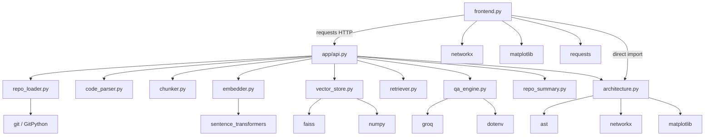
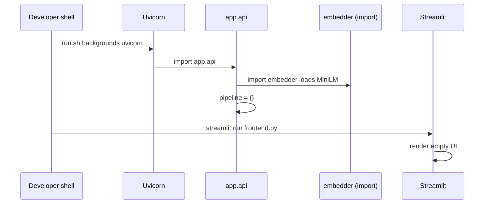

# Chapter 4 — Project Structure

## Scope and honesty standard

This chapter maps **every folder and Python module that exists in the repository**, explains how they import each other, and walks the execution path from `./run.sh` to an answer. Descriptions match the code as of the documented tree. Production improvements are labeled **not implemented**.

```
ai-codebase-analyzer/
├── app/
│   ├── __init__.py          # empty package marker
│   ├── api.py               # FastAPI app + global pipeline
│   ├── repo_loader.py       # Git clone / reuse
│   ├── code_parser.py       # walk + read source files
│   ├── chunker.py           # 500-character slices
│   ├── embedder.py          # SentenceTransformer encode
│   ├── vector_store.py      # FAISS IndexFlatL2 build
│   ├── retriever.py         # top_k search → chunks
│   ├── qa_engine.py         # Groq prompt + completion
│   ├── repo_summary.py      # languages / modules / counts
│   └── architecture.py     # AST import graph (+ visualize)
├── data/                    # cloned repos (gitignored contents)
├── docs/knowledge-base/     # these chapters
├── frontend.py              # Streamlit UI
├── requirements.txt
├── run.sh
├── README.md
├── LICENSE                  # MIT
├── .gitignore
├── .env                     # local secrets (gitignored)
└── venv/                    # local virtualenv (gitignored)
```

There is **no** `tests/`, `Dockerfile`, `docker-compose.yml`, CI config, or `app/services/` package hierarchy.

---

## 1. Why the structure looks like this

### Why a flat `app/` package

The pipeline is a **linear sequence of pure-ish functions**. A flat module-per-stage layout makes the RAG story readable in interview order:

```
clone → load files → chunk → embed → index → retrieve → generate
```

### Why not a deep layered architecture

Hexagonal/clean architecture would add ports, adapters, and interfaces. That helps large teams; here it would obscure a ~dozen short functions. The cost is weak contracts: dictionaries everywhere, a global singleton, and no domain types.

### Why frontend sits at repo root

`frontend.py` is a Streamlit entrypoint, not an installable package module. Keeping it at the root matches `streamlit run frontend.py` and README instructions. It still imports `app.architecture`, so the project root must be on `PYTHONPATH` (typical when you run from the repo root).

### Tradeoffs of this layout

| Advantage | Disadvantage |
|---|---|
| Easy to navigate | No clear domain vs infrastructure boundary |
| One file ≈ one stage | Cross-cutting concerns (logging, errors) have nowhere to live |
| Matches README diagram | Frontend duplicates architecture work already exposable via API |
| Fast onboarding | Global state in `api.py` couples HTTP to memory lifecycle |

### When not to keep this structure

- Multiple services or packages need independent versioning.
- You add auth, jobs, and persistence — then introduce `domain/`, `workers/`, `api/`, `infra/`.
- Multiple UIs share logic — move graph/summary helpers behind the API only.

---

## 2. Top-level files

### 2.1 `run.sh`

```bash
#!/bin/bash
echo "Starting backend..."
uvicorn app.api:app --reload &
echo "Starting frontend..."
streamlit run frontend.py
```

**Concept by concept:**

| Line | Meaning |
|---|---|
| `uvicorn app.api:app` | Load module `app.api`, serve ASGI object `app` |
| `--reload` | Dev auto-restart on code change; **clears in-memory `pipeline`** |
| `&` | Background only the backend; shell continues |
| `streamlit run frontend.py` | Foreground UI; Ctrl+C stops Streamlit, **not necessarily** the background Uvicorn cleanly |

**Edge cases:**

- No `set -e`, PID file, or trap for cleanup.
- If port 8000 is taken, backend fails while frontend still starts.
- Reloading backend after analyze requires re-analyze before ask.

**Alternatives (**not implemented**):** process manager (Honcho/Foreman), Compose, systemd, separate terminals with health checks.

### 2.2 `requirements.txt`

Unpinned bare package names. **Why:** fastest demo install. **Disadvantage:** non-reproducible builds across dates. Production should pin hashes (**not implemented**).

### 2.3 `README.md`

Marketing-level overview. Important honesty gaps vs code:

- UI implies broader capability than six extensions + Python-only graph.
- “No hallucinations” messaging in the UI is stronger than retrieval+prompting can guarantee.
- Limitations section correctly notes in-memory index loss on restart.

### 2.4 `LICENSE`

MIT © 2026 Yadunandan M Nimbalkar. Does **not** relicense cloned third-party repositories under `data/`.

### 2.5 `.gitignore`

Ignores `venv/`, `__pycache__/`, `*.pyc`, `.env`, `data/*` (with `!data/.gitkeep` pattern intent), logs, `.streamlit/`, `.DS_Store`.

**Why ignore `data/*`:** clones are large and not source-of-truth for the app. **Edge case:** local demos leave repos on disk that peers do not get from git.

### 2.6 `.env`

Expected shape (from README):

```
GROQ_API_KEY=your_api_key
```

Loaded only in `qa_engine.py` via `load_dotenv()`. Never commit this file.

### 2.7 `venv/`

Local virtual environment; not part of the application design.

### 2.8 `docs/`

Knowledge-base documentation (this tree). Not imported by the runtime.

---

## 3. The `data/` folder

### What it is

Default `save_dir` for `clone_repository`. Each clone lands at `data/<repo_name>` where `repo_name` is the last URL path segment with `.git` stripped.

### Why it exists

The pipeline needs a filesystem tree for:

1. reading source during indexing;
2. walking files for summary;
3. frontend AST graph after analyze.

### Lifecycle

```
first analyze(url)  → clone into data/<name>
later analyze(same name) → reuse directory, no git fetch
backend restart → data remains; FAISS index does not
manual delete → next analyze reclones
```

### Examples from a typical local disk

A developer machine may contain folders such as `data/flask`, `data/ASD_Early-Screen`, etc. These are **runtime artifacts**, not application source.

### Edge cases and disadvantages

| Issue | Why it happens |
|---|---|
| Stale code | Existence short-circuit skips pull |
| Wrong repo, same name | `https://github.com/a/flask` vs `https://github.com/b/flask` |
| Disk fill | No size quota |
| Path assumptions | Frontend rebuilds `data/<last-segment>` independently of API return value |

### Scalability

Unbounded growth until operators delete directories. **Not implemented:** TTL GC, per-tenant quotas, content-addressed store.

### When not to use plain `data/<name>`

Multi-tenant SaaS, untrusted URLs, or compliance needing pinned commit snapshots with deletion audit trails.

---

## 4. Global `pipeline` state

Defined in `app/api.py`:

```python
pipeline = {}
```

### Why it exists

Avoid passing index/chunks through a database. After `/analyze`, `/ask` needs the same process memory.

### What keys are written

| Key | Set by | Type (conceptual) |
|---|---|---|
| `"chunks"` | `/analyze` | `list[dict]` with `file_path`, `chunk` |
| `"index"` | `/analyze` | `faiss.IndexFlatL2` |
| `"summary"` | `/analyze` | `dict` with languages, modules, counts |

`/ask` reads `"index"` and `"chunks"` only.

### Critical invariant

`index` row `i` describes `chunks[i]`. Nothing in the type system enforces this — only careful ordering in `/analyze`.

### Concurrency / multi-user failure mode

```
User A analyze repoX → pipeline = {chunks_X, index_X}
User B analyze repoY → pipeline = {chunks_Y, index_Y}  # A’s state gone
User A ask           → answers about Y (or races mid-assignment)
```

Assignments to `chunks` and `index` are separate statements → torn reads are possible under concurrency.

### Alternatives (**not implemented**)

Per-repo dict keyed by ID; disk-persisted FAISS; Redis/DB metadata; worker-local stores with sticky routing (still fragile).

---

## 5. Import graph



**ASCII view:**

```
frontend.py ──HTTP──► app/api.py ─┬─ repo_loader
                                  ├─ code_parser
                                  ├─ chunker
                                  ├─ embedder ── SentenceTransformer
                                  ├─ vector_store ── faiss, numpy
                                  ├─ retriever
                                  ├─ qa_engine ── groq, dotenv
                                  ├─ repo_summary
                                  └─ architecture ── ast, networkx, matplotlib
frontend.py ──import──► architecture (duplicate path for graph UI)
```

**Design note:** `chunker`, `retriever`, and `code_parser` intentionally have **no third-party imports** — easy to unit test in isolation (**tests not implemented**).

---

## 6. Package marker: `app/__init__.py`

Empty file. **Why:** makes `app` a regular package so `uvicorn app.api:app` and `from app.repo_loader import ...` resolve. No shared package-level state lives here (the global state is in `api.py` instead).

---

## 7. Module walkthroughs

Each subsection explains **why the module exists**, then **what each concept does**, with edge cases.

---

### 7.1 `app/api.py` — HTTP boundary and orchestration

**Why:** Expose the pipeline over HTTP so Streamlit (or curl) can drive it without importing ML stacks into the UI process for indexing/QA.

#### Imports

Brings each pipeline stage and Pydantic/FastAPI. No middleware, CORS config, or lifespan hooks.

#### `app = FastAPI()`

Creates the ASGI application object referenced by Uvicorn.

#### Request models

```python
class RepoRequest(BaseModel):
    repo_url: str

class QuestionRequest(BaseModel):
    question: str
```

**Why Pydantic:** reject non-object JSON shapes early. **Not validated:** URL scheme, length, SSRF, empty strings beyond type presence.

#### `pipeline = {}`

Module-global mutable store (see §4).

#### `POST /analyze` → `analyze_repo`

Conceptual sequence:

1. `clone_repository(request.repo_url)` → path string.
2. `load_code_files(repo_path)` → list of `{file_path, content}`.
3. `chunk_code(files)` → list of `{file_path, chunk}`.
4. `embed_chunks(chunks)` → matrix-like embeddings.
5. `build_index(embeddings)` → FAISS index.
6. Store `chunks` and `index` on `pipeline`.
7. `generate_repo_summary(repo_path, chunks)` → summary dict; store on `pipeline`.
8. Return message, chunk count, summary.

**Why synchronous:** simplest control flow for a demo. **Disadvantage:** long requests block the worker.

**Edge cases:**

- Empty supported files → later `embeddings[0]` fails inside `build_index`.
- Exceptions largely uncaught → HTTP 500.
- Overwrites previous repo state unconditionally.

#### `POST /ask` → `ask_question`

1. `embed_query(question)`.
2. `retrieve(pipeline["index"], query_embedding, pipeline["chunks"])`.
3. `generate_answer(question, retrieved)`.
4. Return `{"answer": ...}`.

**Edge cases:**

- No prior analyze → `KeyError` on `pipeline["index"]`.
- Does not return citations or distances.

#### `POST /architecture` → `architecture`

Clones (or reuses) repo, builds dependency graph dict, returns `{"architecture": graph}`.

**Important:** `frontend.py` does **not** call this endpoint; it imports `build_dependency_graph` directly.

---

### 7.2 `app/repo_loader.py` — acquire source

**Why:** Separate Git transport from parsing/indexing.

#### `clone_repository(repo_url, save_dir="data")`

| Step | Code concept | Why / risk |
|---|---|---|
| Derive name | `repo_url.split("/")[-1].replace(".git","")` | Human-readable cache key; collision-prone |
| Build path | `os.path.join(save_dir, repo_name)` | Relative to CWD |
| Short-circuit | `if os.path.exists(repo_path): return` | Speeds demos; freezes stale trees |
| Clone | `git.Repo.clone_from(repo_url, repo_path)` | Network + disk; unvalidated URL |

**Returns:** filesystem path string.

**When not to use this design:** untrusted multi-tenant input; need branch/SHA pin; need shallow clone.

**Alternatives:** return `(path, commit_sha, fetched: bool)`; hash URL into directory name; always fetch with timeout (**not implemented**).

---

### 7.3 `app/code_parser.py` — discover readable source

**Why:** Turn a directory tree into a list of text documents for chunking.

#### `SUPPORTED_EXTENSIONS`

```python
[".py", ".js", ".ts", ".java", ".cpp", ".c"]
```

**Why these six:** common teaching languages. **Missing:** `.tsx`, `.go`, `.rs`, `.kt`, notebooks, etc.

#### `load_code_files(repo_path)`

- `os.walk` recursively.
- For each file ending with a supported extension, `open(..., encoding="utf-8")`.
- Append `{"file_path": ..., "content": ...}`.
- Bare `except: continue` skips failures (and can swallow unexpected errors).

**Disadvantages:**

- Loads entire file contents into RAM for all files before chunking finishes using them.
- No ignore of `node_modules`, `.venv`, `dist`, minified bundles.
- Absolute-ish paths depend on CWD/`repo_path` joining (typically `data/...` relative paths).

**Complexity:** O(files × size) I/O and memory.

---

### 7.4 `app/chunker.py` — fixed character windows

**Why:** Embedders need bounded inputs; naive splitting is language-agnostic.

#### `chunk_code(code_files, chunk_size=500)`

For each file content string `text`:

```
for i in range(0, len(text), 500):
    emit {file_path, chunk: text[i:i+500]}
```

**Why 500 characters:** simple constant — **not tokens**, not AST nodes, no overlap.

**Tradeoffs:**

| Pros | Cons |
|---|---|
| Tiny code | Splits mid-function / mid-identifier |
| Language-agnostic | No line metadata |
| Predictable sizes | No overlap → boundary context loss |

**When not to use:** production code RAG — prefer syntax-aware chunking with overlap (**not implemented**).

---

### 7.5 `app/embedder.py` — dense vectors

**Why:** Map chunk text and queries into the same vector space for FAISS.

#### Module-level model

```python
model = SentenceTransformer("all-MiniLM-L6-v2")
```

Loaded at **import time**. First API process start pays download/load cost. All requests share one model object.

#### `embed_chunks(chunks)`

Extracts `c["chunk"]` strings → `model.encode(texts)` → returns embedding matrix.

#### `embed_query(query)`

`model.encode([query])` → shape `(1, 384)` typically, matching FAISS search batch API.

**Edge cases:** empty `chunks` → empty encode result → `build_index` fails on `embeddings[0]`. Huge lists → memory spike.

---

### 7.6 `app/vector_store.py` — build exact L2 index

**Why:** Persist vectors in a searchable structure for the lifetime of the process.

#### `build_index(embeddings)`

1. `dimension = len(embeddings[0])`
2. `faiss.IndexFlatL2(dimension)`
3. `index.add(np.array(embeddings))`
4. Return index

**No** `faiss.write_index`. **No** ID maps. **No** normalization.

---

### 7.7 `app/retriever.py` — nearest chunks

**Why:** Isolate search→chunk mapping from FastAPI and the LLM.

#### `retrieve(index, query_embedding, chunks, top_k=5)`

```python
distances, indices = index.search(query_embedding, top_k)
for idx in indices[0]:
    results.append(chunks[idx])
```

**Distances are discarded.** No score threshold. If FAISS returns `-1` for missing neighbors, using that as a Python index can yield wrong/`chunks[-1]` behavior.

**Why top_k=5:** small prompt context for demos. Broad questions may need more or hierarchical retrieval (**not implemented**).

---

### 7.8 `app/qa_engine.py` — generation

**Why:** Convert retrieved evidence + question into an explanation string.

#### Startup

`load_dotenv()`; construct `Groq(api_key=os.getenv("GROQ_API_KEY"))` at import.

#### `generate_answer(question, retrieved_chunks)`

1. Join chunks as `File: {path}\n{chunk}` blocks.
2. Build a senior-engineer style prompt asking which file/module handles the functionality.
3. Call `llama-3.3-70b-versatile` at `temperature=0.2`.
4. Return message content string.

**Not implemented:** streaming, system/user role split beyond single user message, max tokens, retries, citation JSON, refusal when context empty.

**Security:** retrieved repo text is untrusted prompt input (prompt injection via comments/READMEs).

---

### 7.9 `app/repo_summary.py` — dashboard metrics

**Why:** Give the UI something to show after indexing besides “success.”

#### `generate_repo_summary(repo_path, chunks)`

Walks **all** files under `repo_path` (not only supported source):

- increments `total_files` for every file;
- adds language labels for `.py/.js/.ts/.java` only (note: `.cpp`/`.c` indexed by parser but **not** labeled here);
- appends every `.py` filename to `modules`;
- `main_modules = modules[:5]` — first five discovered `.py` basenames in walk order, **not** importance ranking;
- `total_chunks = len(chunks)`.

**Frontend contract:** expects keys `total_files`, `total_chunks`, `languages`, `main_modules`.

---

### 7.10 `app/architecture.py` — import graph

**Why:** Optional static view of Python import relationships for teaching.

#### `build_dependency_graph(repo_path)`

- Walk tree; only `.py` files.
- `ast.parse`; on failure `continue` (bare except).
- Collect `ast.Import` names and `ast.ImportFrom` modules.
- Key graph by **`file` basename**, not full path → collisions.

Returns `dict[str, list[str]]` e.g. `{"api.py": ["fastapi", "pydantic", ...]}`.

#### `visualize_graph(graph)`

Builds `nx.DiGraph`, `nx.draw`, `plt.show()`. Used for non-Streamlit contexts; Streamlit reimplements drawing in `frontend.py`.

**Not used by RAG answers.**

---

## 8. `frontend.py` — presentation process

**Why:** Provide a single-page demo UX without a JS build pipeline.

### Structure (conceptual regions)

| Region | Responsibility |
|---|---|
| Imports / `API_URL` | Hard-coded `http://127.0.0.1:8000` |
| `st.set_page_config` | Title, icon, wide layout |
| Large `st.markdown` CSS | Dark theme, fonts, cards |
| Hero HTML | Branding |
| Analyze section | Text input + button → `POST /analyze` |
| Summary rendering | Metrics + module pills from JSON |
| Graph section | Local `build_dependency_graph` + NetworkX + matplotlib |
| Ask section | `POST /ask` → HTML answer box |
| Footer | Credits |

### Analyze button flow

1. `requests.post(f"{API_URL}/analyze", json={"repo_url": repo_url})`.
2. On 200, read `data["summary"]` and render cards.
3. Derive `repo_name = repo_url.split("/")[-1]` and `repo_path = os.path.join("data", repo_name)`.
4. `graph = build_dependency_graph(repo_path)`.
5. Print edges; draw `DiGraph`.

**Mismatch risk:** if API cloned with `.git` stripped differently than frontend’s split, paths can diverge (frontend does not strip `.git` in this derivation).

### Ask button flow

1. `POST /ask` with question.
2. Inject `answer` into `.answer-box` via `unsafe_allow_html=True`.

**XSS risk:** model output can include HTML/script-like content.

### Design disadvantages

- No Streamlit session persistence of “which repo is active” beyond backend memory.
- No client timeout.
- Marketing line “no hallucinations” overclaims.

### When not to grow this file further

At ~480 lines of mixed CSS/UI/network, further features should split components or move to a real frontend (**not implemented**).

---

## 9. End-to-end execution flows

### 9.1 Process start



### 9.2 Analyze

```
Browser → Streamlit → POST /analyze → clone → load → chunk → embed → FAISS
         → pipeline{chunks,index,summary} → JSON summary
         → Streamlit renders metrics
         → Streamlit local AST graph + pyplot
```

### 9.3 Ask

```
Browser → Streamlit → POST /ask → embed query → FAISS top5 → Groq → answer HTML
```

### 9.4 Architecture endpoint (API-only path)

```
Client → POST /architecture → clone/reuse → build_dependency_graph → JSON
```

Frontend currently skips this path.

---

## 10. Dependency direction and design rules observed

| Rule visible in code | Benefit | Cost |
|---|---|---|
| Stages do not import `api.py` | Avoid circular imports | Orchestration only at edge |
| Embedder loads model globally | Amortize load cost | Harder to swap models per request |
| Retriever does not call Groq | Testable retrieval | API must wire both |
| Frontend talks HTTP for RAG | Process isolation | Dual processes to run |
| Frontend imports architecture | Fewer round trips | Duplicates `/architecture` |

---

## 11. Complexity map by file

| File | Approx. size | Cyclomatic feel | Scaling hotspot |
|---|---:|---|---|
| `api.py` | small | low | global state, sync work |
| `repo_loader.py` | tiny | low | clone size/time |
| `code_parser.py` | small | low | RAM for all files |
| `chunker.py` | tiny | low | chunk count explosion |
| `embedder.py` | tiny | low | encode batch |
| `vector_store.py` | tiny | low | RAM for index |
| `retriever.py` | tiny | low | O(C·D) Flat search |
| `qa_engine.py` | small | low | LLM latency/cost |
| `repo_summary.py` | small | low | full tree walk |
| `architecture.py` | small | medium | AST on all py files |
| `frontend.py` | large | UI-heavy | graph draw, HTML |

---

## 12. What is intentionally missing from the tree

| Missing path | Why beginners expect it | Reality |
|---|---|---|
| `tests/` | Confidence | **Not implemented** |
| `Dockerfile` | Deploy story | **Not implemented** |
| `app/models.py` | Shared schemas | Dicts inline |
| `app/config.py` | Central settings | Hard-coded constants + `.env` |
| `workers/` | Async analyze | Sync in request |
| `alembic/` / DB | Persistence | None |

---

## 13. Practical examples

### Example A: analyze Flask

1. UI URL `https://github.com/pallets/flask`.
2. Clone or reuse `data/flask`.
3. Read `.py` (and other supported) files; chunk every 500 chars.
4. Embed; build Flat L2 index; save on `pipeline`.
5. Summary counts all files under `data/flask`; lists first five `.py` basenames encountered.
6. Frontend graphs imports keyed by basename (`app.py` → `flask`, ...).

### Example B: ask without analyze after reload

1. Uvicorn `--reload` or restart clears `pipeline`.
2. `data/flask` may still exist.
3. `/ask` raises `KeyError` → UI shows generic error.
4. User must click Analyze again (reuse clone, redo embed/index).

### Example C: two repos, same final name

1. Analyze `https://github.com/org1/demo` → `data/demo`.
2. Analyze `https://github.com/org2/demo` → reuses `data/demo` without fetching org2.
3. Answers describe org1’s tree while user believes org2 was loaded.

---

## 14. Production structure recommendation (**not implemented**)

```
src/
  api/            # HTTP, auth, DTOs
  workers/        # clone/embed jobs
  domain/         # RepositoryId, IndexVersion
  rag/            # chunk, embed, retrieve ports
  infra/          # git, faiss files, s3, postgres
web/              # React or similar
deploy/           # compose/k8s
tests/
```

Keep the **logical** pipeline stages; change packaging and state ownership.

---

## 15. Interview handbook

### Beginner

**Question:** What is the role of the `app/` directory?

**Ideal Answer:** It is the Python package containing the FastAPI app and each RAG/static-analysis stage module. Uvicorn loads `app.api:app`. Streamlit lives outside as `frontend.py`.

**Why interviewer asked it:** Repo literacy.

**Common mistakes:** Saying frontend is inside `app/`; inventing Controllers/Services folders.

**Follow-up questions:** What does empty `__init__.py` do?

**Question:** What does `run.sh` start?

**Ideal Answer:** Background Uvicorn for the API with reload, then Streamlit for the UI in the foreground.

**Why interviewer asked it:** Process model basics.

**Common mistakes:** Claiming Docker Compose starts; forgetting reload side effects.

**Follow-up questions:** How do you stop the background Uvicorn?

**Question:** Where is the FAISS index stored on disk?

**Ideal Answer:** It isn’t. Only clones live under `data/`. The index is in the `pipeline` dict in RAM.

**Why interviewer asked it:** Persistence clarity.

**Common mistakes:** Pointing at a nonexistent `index.faiss` file.

**Follow-up questions:** What survives restart?

**Question:** List the modules called by `/analyze` in order.

**Ideal Answer:** `clone_repository` → `load_code_files` → `chunk_code` → `embed_chunks` → `build_index` → store pipeline → `generate_repo_summary`.

**Why interviewer asked it:** Pipeline memorization from structure.

**Common mistakes:** Inserting retriever/QA into analyze.

**Follow-up questions:** Where is retrieve used?

**Question:** Why is `data/` gitignored?

**Ideal Answer:** Cloned third-party repos are large runtime artifacts, not app source; ignoring prevents accidental commits.

**Why interviewer asked it:** Repo hygiene.

**Common mistakes:** Thinking the app cannot run without committed data.

**Follow-up questions:** How does a fresh clone of *this* project get demo data?

**Question:** What file reads `GROQ_API_KEY`?

**Ideal Answer:** `app/qa_engine.py` via dotenv/getenv. Frontend never loads it.

**Why interviewer asked it:** Secret boundary.

**Common mistakes:** Claiming Streamlit needs the key.

**Follow-up questions:** Why is that a good boundary?

**Question:** Does the frontend call `/architecture`?

**Ideal Answer:** No. It imports `build_dependency_graph` and runs it in the Streamlit process after analyzing.

**Why interviewer asked it:** Read-the-code vs README diagrams.

**Common mistakes:** Assuming all API routes are used by the UI.

**Follow-up questions:** Why might the API route still exist?

### Intermediate

**Question:** Why keep `retriever.py` separate from `vector_store.py`?

**Ideal Answer:** Building an index and querying it are different stages with different lifetimes. Separation keeps FAISS add logic independent from top-k mapping to chunk dicts and matches the teaching pipeline.

**Why interviewer asked it:** Module cohesion.

**Common mistakes:** “More files are always better.”

**Follow-up questions:** Would you merge them in a tiny script?

**Question:** How can frontend and API disagree about `repo_path`?

**Ideal Answer:** API uses loader logic stripping `.git`; frontend rebuilds `data/` + last URL segment without the same normalization and without using the API’s returned path (API doesn’t return path today).

**Why interviewer asked it:** Contract design.

**Common mistakes:** Assuming one function is shared.

**Follow-up questions:** What API field would fix this?

**Question:** Why is global `pipeline` in `api.py` instead of a dedicated `state.py`?

**Ideal Answer:** Convenience for a tiny app. A dedicated module wouldn’t fix concurrency alone but would clarify ownership; real fix is keyed durable state.

**Why interviewer asked it:** Accidental vs essential complexity.

**Common mistakes:** Saying globals are fine in production APIs.

**Follow-up questions:** Show a race between two analyzes.

**Question:** Which modules are safe to unit test without network?

**Ideal Answer:** `chunker.py` fully; `repo_summary` with temp dirs; `architecture` with sample files; `retriever` with a tiny FAISS fixture. `repo_loader` and `qa_engine` need mocks for Git/Groq.

**Why interviewer asked it:** Testability from structure.

**Common mistakes:** Claiming nothing is testable without the full app.

**Follow-up questions:** How would you fake FAISS?

**Question:** Why does `embedder.py` import the model at module level?

**Ideal Answer:** Avoid reloading weights per request. Side effect: import time becomes heavy and model choice is process-global.

**Why interviewer asked it:** Lifecycle hooks awareness.

**Common mistakes:** Reloading the model inside `/ask` every time as “cleaner.”

**Follow-up questions:** How would FastAPI lifespan help?

**Question:** Explain the dual responsibility of `architecture.py`.

**Ideal Answer:** It both builds a dict graph and offers matplotlib visualization. Streamlit only needs the builder; visualization is alternate entry behavior.

**Why interviewer asked it:** SRP pressure in small files.

**Common mistakes:** Saying NetworkX runs inside FAISS.

**Follow-up questions:** Should visualize live in frontend only?

### Advanced

**Question:** How would you restructure to support multiple indexed repos?

**Ideal Answer:** Introduce `RepositoryId`/`IndexVersion`; store `pipeline[repo_id] = {chunks, index, summary}` or external store; `/ask` must include repo id; publish indexes atomically; garbage-collect old versions. Flat files under `data/` get UUID dirs.

**Why interviewer asked it:** Evolutionary architecture.

**Common mistakes:** Only adding a mutex around the singleton.

**Follow-up questions:** How do clients discover repo ids?

**Question:** Identify circular-import risks if `embedder` imported `api`.

**Ideal Answer:** `api` already imports `embedder`. Reverse import at module level creates circular initialization bugs. Keep orchestration at edges; pass data downward.

**Why interviewer asked it:** Python packaging discipline.

**Common mistakes:** Ignoring import-time model load side effects.

**Follow-up questions:** When are lazy imports acceptable?

**Question:** The summary counts `.cpp` files in `total_files` via walk but may not mark C++ in `languages`. Is that a structure bug or product bug?

**Ideal Answer:** Product/consistency bug in `repo_summary` logic relative to `SUPPORTED_EXTENSIONS` in `code_parser`. Structure allowed divergent definitions because constants aren’t shared.

**Why interviewer asked it:** DRY across modules.

**Common mistakes:** Saying os.walk skips binaries only.

**Follow-up questions:** Where should shared extension config live?

**Question:** Design a package layout that allows swapping Groq for a local LLM.

**Ideal Answer:** Define a `Generator` protocol in `rag/generate.py`; `qa_engine` becomes an adapter; config selects implementation; `api` depends on protocol. Keep prompt building separate from transport.

**Why interviewer asked it:** Ports and adapters without over-engineering demos.

**Common mistakes:** Rewriting everything into Java-style abstract factories on day one.

**Follow-up questions:** How do you test the prompt builder?

**Question:** Why is putting CSS in `frontend.py` a maintainability risk?

**Ideal Answer:** A 300-line style string mixes presentation with control flow, complicates review, and fights Streamlit’s DOM. Separate theme files or a real FE app scales better.

**Why interviewer asked it:** Frontend structure judgment.

**Common mistakes:** “It’s fine forever because it’s one file.”

**Follow-up questions:** What would you extract first?

**Question:** How does `--reload` interact with module-level Singletons?

**Ideal Answer:** Reload reimports modules: new empty `pipeline`, reloads MiniLM, recreates Groq client. Disk clones remain, creating “half warm” state that confuses users.

**Why interviewer asked it:** Dev UX vs state.

**Common mistakes:** Thinking reload preserves RAM indexes.

**Follow-up questions:** Would FAISS on disk fix demo DX?

### FAANG

**Question:** Propose a mono-repo structure for a team of 12 owning this product.

**Ideal Answer:** Split API, worker, web, and shared proto/schemas; CI per package; ownership CODEOWNERS; feature flags; contract tests between web and API; migrate off global state before hiring growth. Keep RAG stage libraries versioned.

**Why interviewer asked it:** Org-architecture fit.

**Common mistakes:** One mega folder with no boundaries.

**Follow-up questions:** How do you prevent workers importing Streamlit?

**Question:** Where do you place tenancy enforcement in this tree?

**Ideal Answer:** At the API edge (authn/z middleware) before clone/retrieve, and again in the retrieval store query filters — defense in depth. Not inside `chunker`.

**Why interviewer asked it:** Security layering.

**Common mistakes:** Only checking tenant in the UI.

**Follow-up questions:** How do you test bypass attempts?

**Question:** Migrate from flat modules to plugins for languages without breaking API.

**Ideal Answer:** Keep `/analyze` façade; internally select parsers by extension via registry; version the indexing run with parser versions; dual-run shadow indexing for quality.

**Why interviewer asked it:** Extensibility under compatibility.

**Common mistakes:** Hardcoding more `if endswith` scattered everywhere.

**Follow-up questions:** How do plugin failures isolate?

**Question:** What observability hooks belong in which files?

**Ideal Answer:** `api.py`: request metrics/trace context; `repo_loader`: clone timing/bytes; `embedder`: batch size/latency; `retriever`: empty-hit rates; `qa_engine`: tokens/cost; frontend: RUM optional. Avoid logging secrets/code at info level by default.

**Why interviewer asked it:** Cross-cutting placement.

**Common mistakes:** Only print statements in loader.

**Follow-up questions:** How to redact prompts?

**Question:** How would you organize code so IndexFlatL2 can be replaced by Qdrant with minimal churn?

**Ideal Answer:** `vector_store` becomes an interface: `build/add/search/persist`. Retriever depends on search port. API wires implementation from config. Chunk ID scheme becomes explicit instead of positional.

**Why interviewer asked it:** Infrastructure abstraction timing.

**Common mistakes:** Abstracting too early on day one vs too late after five call sites.

**Follow-up questions:** What ID type do you introduce first?

**Question:** Critique storing orchestration in `api.py` for a high-QPS service.

**Ideal Answer:** HTTP handlers should not own multi-minute workflows. Move to application services + queue; API enqueues and returns job ids; structure grows `workers/` and `app/services/analyze.py`.

**Why interviewer asked it:** Request lifecycle design.

**Common mistakes:** Adding threads inside the handler as the final architecture.

**Follow-up questions:** Exactly-once vs at-least-once indexing?

### Follow-up

**Question:** If you could add only one directory, what would it be?

**Ideal Answer:** `tests/` with chunker/retriever unit tests — highest confidence per line for this structure.

**Why interviewer asked it:** Prioritization.

**Common mistakes:** Adding `kubernetes/` first.

**Follow-up questions:** What is the first test case?

**Question:** Should `SUPPORTED_EXTENSIONS` move next to summary language detection?

**Ideal Answer:** Yes into a shared `app/languages.py` or config to prevent drift between parser and summary.

**Why interviewer asked it:** Consistency refactor sense.

**Common mistakes:** Duplicating lists “for independence.”

**Follow-up questions:** Include `.cpp` in languages?

**Question:** Why might `visualize_graph` be dead code in the Streamlit demo path?

**Ideal Answer:** Frontend draws with its own `nx.draw`/`st.pyplot` and never calls `visualize_graph`. The function remains for scripts/`plt.show()` contexts.

**Why interviewer asked it:** Dead code detection.

**Common mistakes:** Insisting Streamlit calls it.

**Follow-up questions:** Delete or wire it?

**Question:** How does package import of `app.architecture` from `frontend.py` depend on CWD?

**Ideal Answer:** Running `streamlit run frontend.py` from repo root puts the root on `sys.path`, allowing `app` imports. Running from another cwd can break imports unless PYTHONPATH is set.

**Why interviewer asked it:** Python runtime path subtleties.

**Common mistakes:** Assuming installs via pip editable are configured (they aren’t in README).

**Follow-up questions:** Would `pip install -e .` help? (Needs packaging config — **not implemented**.)

**Question:** What belongs in `.env` vs hard-coded constants?

**Ideal Answer:** Secrets and environment-specific endpoints in env; model names/chunk sizes could be env too but are hard-coded today (`500`, MiniLM, Groq model string).

**Why interviewer asked it:** Config hygiene.

**Common mistakes:** Putting chunk size secrets… or leaving API keys in source.

**Follow-up questions:** Which constant would you externalize first?

**Question:** Describe the README structure section vs reality.

**Ideal Answer:** It matches the main modules and `data/`, `frontend.py`, `run.sh`, `.env`. It omits `docs/`, `venv/`, `__pycache__`, and does not mention empty `__init__.py` or lack of tests.

**Why interviewer asked it:** Doc drift awareness.

**Common mistakes:** Treating README as executable truth.

**Follow-up questions:** What else drifted in README features?

### Trick Questions

**Question:** Is there a `database.py` module?

**Ideal Answer:** No. Persistence is `data/` files plus RAM `pipeline`.

**Why interviewer asked it:** Invented layers check.

**Common mistakes:** Pointing at FAISS as database module.

**Follow-up questions:** Where would you add one?

**Question:** Does `chunker.py` use LangChain text splitters?

**Ideal Answer:** No. It is pure Python slicing. LangChain is not in `requirements.txt`.

**Why interviewer asked it:** Buzzword injection resistance.

**Common mistakes:** Answering from generic RAG tutorials.

**Follow-up questions:** Pros of adopting a splitter library?

**Question:** Which file implements authentication middleware?

**Ideal Answer:** None. No auth exists.

**Why interviewer asked it:** Security honesty.

**Common mistakes:** Inventing FastAPI Depends auth.

**Follow-up questions:** Where would you add it?

**Question:** Is `pipeline` cleared between `/ask` calls?

**Ideal Answer:** No. It remains until overwritten by `/analyze` or process restart/reload.

**Why interviewer asked it:** State lifetime.

**Common mistakes:** Assuming request-scoped state.

**Follow-up questions:** Is that good or bad for demos? (Good for multi-ask; bad for multi-repo.)

**Question:** Does `code_parser.py` parse ASTs?

**Ideal Answer:** No. It only reads file text. AST parsing is in `architecture.py` for imports.

**Why interviewer asked it:** Naming vs behavior.

**Common mistakes:** Equating “parser” with AST.

**Follow-up questions:** Why the misleading name?

**Question:** Can you delete `frontend.py` and still use the system?

**Ideal Answer:** Yes — curl/httpie against FastAPI endpoints. The RAG core lives in `app/`. Graph visualization UX would be lost unless you call `/architecture`.

**Why interviewer asked it:** Core vs shell.

**Common mistakes:** Saying Streamlit is required for embeddings.

**Follow-up questions:** Show an example curl for `/ask`.

**Question:** Is `app/api.py` the only place that mutates global indexing state?

**Ideal Answer:** Yes for `pipeline`. Other modules return values; only `analyze_repo` writes those keys. (Model globals in embedder/qa_engine are separate singletons.)

**Why interviewer asked it:** State ownership precision.

**Common mistakes:** Claiming FAISS mutates a global inside `vector_store` beyond the returned object.

**Follow-up questions:** Are those model singletons thread-safe?

**Question:** Does `run.sh` wait for Uvicorn readiness before Streamlit?

**Ideal Answer:** No. It backgrounds Uvicorn and immediately starts Streamlit. Early UI clicks can fail until the API listens.

**Why interviewer asked it:** Race in launcher scripts.

**Common mistakes:** Assuming bash `&` implies readiness gates.

**Follow-up questions:** How would you add a wait-for-port?

---

## 16. Bottom line

The project structure is a **teaching-oriented flat package**: one module per RAG stage, a root Streamlit client, a shell launcher, and a gitignored `data/` cache for clones. The most important structural idea to understand is not a folder name — it is the **process-global `pipeline` dictionary in `api.py`**, which couples HTTP request handling to ephemeral indexing state. Everything else (character chunker, MiniLM embedder, FAISS builder, Groq QA, AST graph) hangs off that simple spine.
