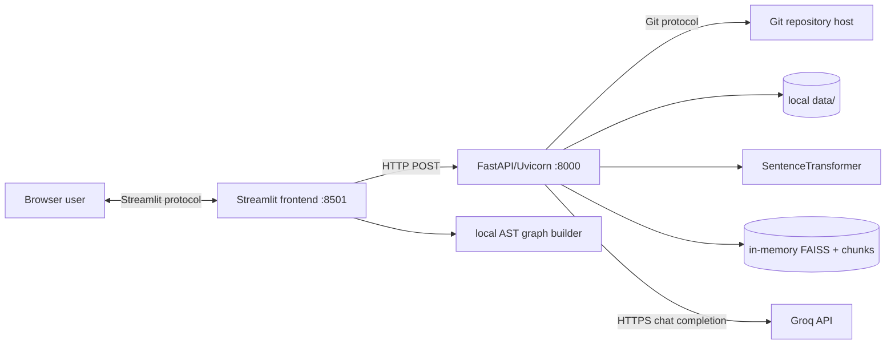
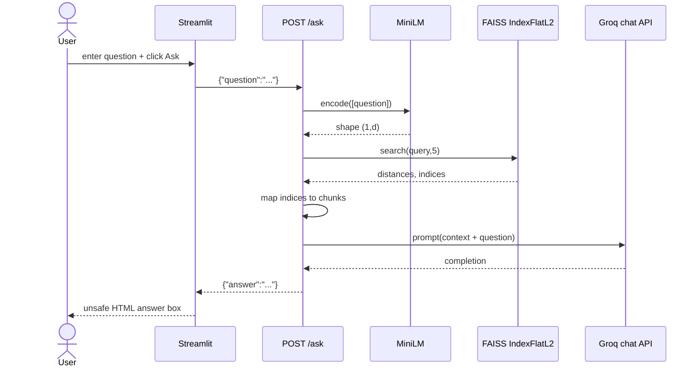
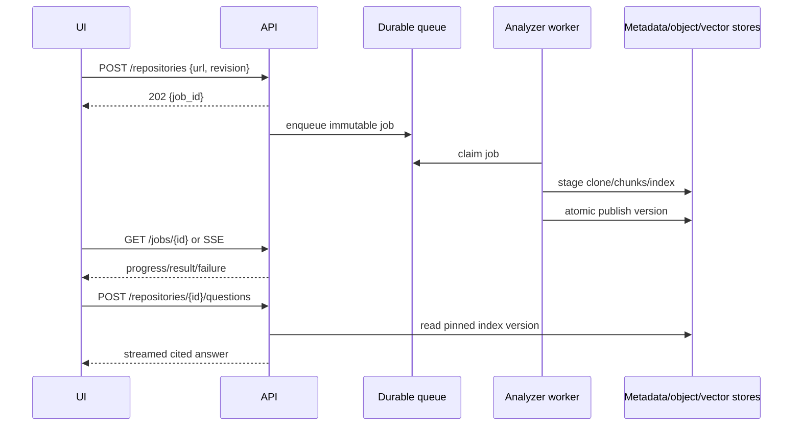

# 05 — Request Flow

## Why trace requests end to end?

A UI label such as “Analyze Repository” hides several trust boundaries: browser-to-Streamlit events, a synchronous HTTP call, filesystem and network I/O, CPU-heavy embedding, mutable process memory, and a second local graph-analysis pass. Understanding those boundaries explains latency, errors, concurrency hazards, and why a response can succeed while the page still fails.

This chapter distinguishes **current implementation facts** from **production recommendations**. A recommendation is not a claim about code that exists.

## Runtime topology



`run.sh` starts Uvicorn in reload mode in the background, then Streamlit in the foreground. The frontend hard-codes `http://127.0.0.1:8000`; this works only when both processes share a network namespace.

## Current page-load path

1. Streamlit executes `frontend.py` top to bottom for a new session and on every widget interaction.
2. Python imports `app.architecture`, NetworkX, Matplotlib, Requests, and Streamlit.
3. Importing `app.api` in the backend separately imports `app.embedder`; that module constructs `SentenceTransformer("all-MiniLM-L6-v2")` at import time. Model loading/download therefore occurs before endpoints are ready.
4. The browser receives the Streamlit-rendered hero, two text inputs, two buttons, and footer. Google Fonts are fetched by browser CSS.
5. No backend health check occurs. A rendered page does not imply FastAPI, the model, Git, Groq credentials, or filesystem are healthy.

**Failure modes:** model download can delay startup; missing dependencies stop import; port collision stops a process; Google Fonts failure only changes presentation; the background Uvicorn process can die while Streamlit remains usable-looking.

## Click 1: Analyze Repository

### Current implementation — exact path

```mermaid
sequenceDiagram
    actor User
    participant UI as Streamlit
    participant API as POST /analyze
    participant Git as GitPython
    participant Disk as data/<repo>
    participant ST as MiniLM encoder
    participant FX as FAISS
    participant Graph as local AST pass

    User->>UI: enter URL + click Analyze
    UI->>API: {"repo_url": "..."}
    API->>Git: clone_from(url,path), unless path exists
    Git->>Disk: checkout repository
    API->>Disk: os.walk + read supported files
    API->>API: fixed 500-character chunks
    API->>ST: model.encode(all chunk texts)
    ST-->>API: dense embeddings
    API->>FX: IndexFlatL2.add(embeddings)
    API->>Disk: second os.walk for summary
    API->>API: overwrite global pipeline
    API-->>UI: 200 message/chunks/summary
    UI->>Disk: third scan; Python AST imports
    UI->>Graph: build and draw directed graph
    UI-->>User: summary, edges, Matplotlib plot
```

The button causes a Streamlit rerun. If its boolean is true on that rerun:

1. `requests.post` synchronously sends JSON to `/analyze`. There is no timeout, retry, authentication, request ID, URL validation, or exception handler.
2. Pydantic accepts an object with string `repo_url`; malformed JSON or absent/wrong-type fields produce FastAPI’s current validation response (normally HTTP 422) before handler execution.
3. `clone_repository` derives `repo_name` from the final URL segment after removing every `.git` substring and joins it under relative `data/`.
4. If that path exists, it is trusted and returned without fetch, pull, origin verification, integrity check, or checking that it is a Git repository.
5. Otherwise GitPython performs a full clone synchronously.
6. `load_code_files` recursively walks all directories, including `.git` and vendor/build trees. Files ending in `.py`, `.js`, `.ts`, `.java`, `.cpp`, or `.c` are read fully as UTF-8. Every exception is silently skipped.
7. `chunk_code` slices each file into non-overlapping 500-character substrings. Empty files produce no chunk.
8. `embed_chunks` creates one list containing all chunk strings and calls MiniLM’s `encode` in one logical batch operation.
9. `build_index` takes `len(embeddings[0])`, creates exact `faiss.IndexFlatL2`, converts embeddings with `np.array`, and adds all vectors.
10. The process-global `pipeline` dictionary receives `chunks`, `index`, then `summary`. It represents only the most recently completed analysis.
11. `generate_repo_summary` walks the repository again. `total_files` includes every file of every type. Languages recognize only Python, JavaScript, TypeScript, and Java. `main_modules` is the first five Python basenames encountered, with possible duplicate names and nondeterministic traversal order.
12. FastAPI serializes:

```json
{
  "message": "Repository indexed successfully",
  "chunks": 123,
  "summary": {
    "languages": ["Python"],
    "main_modules": ["api.py"],
    "total_files": 42,
    "total_chunks": 123
  }
}
```

13. The UI treats only status 200 as success, indexes required response keys directly, and renders metric HTML.
14. The UI independently computes `repo_name = repo_url.split("/")[-1]` **without removing `.git`**. For a URL ending `.git`, the backend stores `data/name`, while the UI scans `data/name.git`; its graph step can therefore be empty even after a 200.
15. The frontend calls `build_dependency_graph` locally rather than `/architecture`. It reads every Python file, parses AST, collects `import x` and `from x import y` module strings, prints every adjacency list, builds a NetworkX `DiGraph`, and renders Matplotlib.

### Current response and error paths

| Event | Actual result |
|---|---|
| Valid request, nonempty supported source | HTTP 200; UI shows summary and graph |
| Existing clone path | Stale local content is re-indexed |
| Empty/no supported files | `embeddings[0]` raises; default HTTP 500 |
| Invalid Git URL/private repo/auth failure | uncaught exception; default HTTP 500 |
| Decode/permission failure for one source | file silently omitted |
| Backend unreachable/timeout/DNS issue | Requests exception escapes; Streamlit displays its exception, not custom error |
| Any non-200 response | generic UI error; server detail discarded |
| 200 with unexpected JSON/schema | frontend raises `JSONDecodeError`/`KeyError` |
| Graph file decode error | uncaught frontend exception after successful index |
| Python syntax error | that file is silently excluded from graph only |

The backend does not explicitly set status codes. Success is 200; uncaught exceptions are generally 500. Partial clone directories can poison later attempts because mere path existence counts as success.

## Click 2: Ask AI

### Current implementation — exact path



1. The click triggers another full Streamlit rerun.
2. The UI synchronously posts the raw question to `/ask`, again without timeout or exception handling.
3. Pydantic validates only that `question` is a string; empty strings are accepted.
4. `embed_query` encodes a one-item list, preserving a two-dimensional `(1,d)` shape expected by FAISS.
5. `retrieve` calls exact L2 search with `top_k=5`, ignores distances, and uses the first result row to index the global chunk list.
6. `generate_answer` concatenates each file path and chunk with blank lines. It interpolates both retrieved code and question into one user-role prompt.
7. Groq is called synchronously with model `llama-3.3-70b-versatile` and temperature `0.2`. No max-token, timeout, retry, streaming, citation contract, or structured response is configured.
8. The first choice’s message content is returned as `{"answer": answer}`.
9. The UI injects the model answer into `unsafe_allow_html=True` markup. LLM-produced HTML can affect the rendered page.

### Current response and error paths

- If analysis has never succeeded in this backend process, `pipeline["index"]` raises `KeyError`; response is normally 500.
- If an analysis is in progress, `/ask` may see the old index or an inconsistent mix because keys are assigned separately without a lock.
- If fewer than five vectors exist, FAISS may return sentinel index `-1`; Python interprets `chunks[-1]` as the last chunk, creating duplicates rather than rejecting invalid neighbors.
- If zero vectors exist, indexing already failed during analysis.
- Missing/invalid `GROQ_API_KEY`, rate limits, model retirement, network errors, or malformed provider responses escape as 500.
- Any non-200 produces a generic UI error. A connection exception bypasses that branch.
- A successful provider answer is unverified and may hallucinate despite the UI claim “no hallucinations.”

## API path not used by the UI: POST `/architecture`

The endpoint accepts the same `{"repo_url": string}` body, clones/reuses the repository, computes Python import adjacency, and returns `{"architecture": graph}`. The frontend never calls it. It instead invokes the same graph function in its own process after `/analyze`.

This endpoint has the same clone and validation issues. AST parse failures are skipped, but file-open failures are not caught. JSON keys are basenames, so two `utils.py` files overwrite each other. Imports are module names, not resolved repository file nodes.

## State, concurrency, and ordering

### Current facts

`pipeline` is a mutable module-level dictionary. It is:

- process-local: multiple Uvicorn workers would each have unrelated state;
- volatile: reload/restart loses it;
- singleton: every user shares and overwrites one repository;
- non-transactional: chunks, index, and summary are written separately;
- unbounded at analysis time: source, chunks, embeddings, and index can coexist in memory;
- not protected by a lock.

FastAPI uses normal `def` handlers, so Starlette runs them in a thread pool. That prevents one blocking handler from directly freezing the event loop, but permits concurrent analysis/ask threads. Python-level and native libraries may execute simultaneously, consuming CPU and memory.

Example race:

```text
Analyze A: pipeline["chunks"] = chunks_A
Analyze B: pipeline["chunks"] = chunks_B
Analyze A: pipeline["index"]  = index_A
Ask: retrieve(index_A, ..., chunks_B)  # wrong mapping or IndexError
```

## Production design — recommended, not implemented

### Why change the request model?

Cloning and embedding have unpredictable, repository-sized latency. Holding one browser HTTP request open couples user experience to Git hosts, model CPU, memory pressure, proxy timeouts, and process restarts.

Recommended flow:



Key controls:

- Validate scheme/host and normalize URLs; reject local/file/SSH targets unless explicitly allowed to prevent SSRF and filesystem access.
- Clone to a random temporary directory, set size/time limits, disable hooks, pin a commit SHA, and atomically rename on success.
- Use repository and version IDs rather than global “latest” state.
- Publish `{chunks,index,metadata}` in one atomic transaction or immutable manifest.
- Bound body sizes, file counts, bytes, embedding batches, prompt tokens, and wall-clock time.
- Return RFC 9457 problem details with stable error codes; preserve provider details only in protected logs.
- Add idempotency keys, cancellation, progress, quotas, authentication, audit logs, metrics, tracing, and circuit breakers.
- Escape model output or render sanitized Markdown; never inject raw model HTML.

### Tradeoffs and alternatives

- **Synchronous request:** simplest and appropriate for tiny trusted repositories or demos; poor for long jobs and restarts.
- **Background queue:** durable and scalable; adds broker, worker, job-state, cleanup, and eventual consistency.
- **WebSocket/SSE progress:** better UX; requires connection lifecycle and proxy support. Polling is simpler but adds latency/load.
- **Single process memory:** lowest operational overhead and fastest local lookup; never use for multi-user durability or horizontal scaling.
- **External vector database:** enables persistence, filters, replicas, and tenant isolation; adds network latency, cost, and consistency concerns. FAISS files plus metadata can be sufficient for one-node workloads.

## Latency and capacity budget

For repository bytes \(B\), supported characters \(C\), chunks \(N=\sum_i\lceil |f_i|/500\rceil\), embedding dimension \(d\), and retrieved count \(k=5\):

\[
T_{analyze}\approx T_{clone}(B)+T_{read}(B)+T_{embed}(N)+O(Nd)+T_{summary}(B)
\ T_{frontend\ AST}(B_{py})
\]

\[
T_{ask}\approx T_{embedQuery}+O(Nd)+T_{Groq}(prompt,\ output)
\]

The provider call typically dominates ask latency; clone/model encoding dominate analysis. Exact FAISS vectors alone use roughly \(4Nd\) bytes for float32, excluding Python strings, dictionaries, source text, temporary embeddings, and model weights.

## Practical example

Given two files of 750 and 100 characters, chunking creates \(\lceil750/500\rceil+\lceil100/500\rceil=3\) vectors. Asking still requests five neighbors. A robust retriever would use `effective_k=min(5, index.ntotal)=3`; current code can map FAISS `-1` placeholders to the last chunk.

## Interview — Beginner

**Question:** What happens after the user clicks “Ask AI”?

**Ideal Answer:** Streamlit reruns, posts the question to FastAPI, MiniLM embeds it, FAISS finds five nearest chunks by squared L2 distance, the backend sends those chunks plus the question to Groq, and the UI renders the returned answer.

**Why interviewer asked it:** To test end-to-end tracing across UI, API, retrieval, and generation.

**Common mistakes:** Saying the browser calls Groq directly; claiming the vector index is persistent; omitting the required prior analysis.

**Follow-up questions:** Where is state stored? What happens after restart? Which step usually dominates latency?

## Interview — Intermediate

**Question:** Why can `/ask` return the wrong repository under concurrent use?

**Ideal Answer:** All users share one process-global dictionary. Analyses overwrite it, and chunks/index are assigned separately, so requests can observe another repository or mismatched versions.

**Why interviewer asked it:** To test shared-state and race-condition reasoning.

**Common mistakes:** Assuming Python’s GIL makes a multi-step workflow atomic; discussing only browser session state.

**Follow-up questions:** How would immutable versions help? Where would tenant authorization be enforced?

## Interview — Advanced

**Question:** Design a failure-safe analysis request.

**Ideal Answer:** Return 202 with a job ID, process a pinned commit in a bounded worker, stage artifacts under a version, atomically publish a manifest only after all checks pass, expose progress/cancellation, and retain structured terminal failure state.

**Why interviewer asked it:** To assess distributed workflow, idempotency, and atomic publication.

**Common mistakes:** Retrying Git clone without cleanup; publishing partial state; omitting quotas and cancellation.

**Follow-up questions:** How do retries avoid duplicate work? How are abandoned artifacts garbage-collected?

## Interview — FAANG

**Question:** How would you support one million repositories and bursty questions?

**Ideal Answer:** Separate ingestion and serving; content-address clones and chunks by commit; queue bounded ingestion; batch embeddings; shard durable vector indexes by tenant/repository; cache query embeddings and popular results; autoscale stateless query services; pin index versions; enforce quotas; instrument SLOs and provider fallbacks.

**Why interviewer asked it:** To test decomposition, capacity thinking, consistency, and cost control.

**Common mistakes:** Saying “add Kubernetes” without data partitioning; ignoring model/provider limits; using one global index without metadata isolation.

**Follow-up questions:** What are shard keys? How do you roll out a new embedding model? How do you prevent hot tenants?

## Interview — Follow-up

**Question:** The API returned 200 but the UI crashed. How is that possible?

**Ideal Answer:** The frontend performs additional unguarded work: assumes response keys, derives a potentially different `.git` path, reads/parses files, builds a graph, and renders it. Any of those can fail after backend success.

**Why interviewer asked it:** To see whether success is understood per boundary, not as a global property.

**Common mistakes:** Treating HTTP 200 as proof the whole user action completed; overlooking duplicate frontend analysis.

**Follow-up questions:** What telemetry correlates the two processes? Which graph work should move behind the API?

## Interview — Trick

**Question:** Does FastAPI’s synchronous handler make analysis requests execute one at a time?

**Ideal Answer:** No. Starlette normally dispatches regular `def` endpoints to a thread pool. Multiple handlers can overlap, and native embedding/FAISS operations may run outside the GIL.

**Why interviewer asked it:** To expose confusion between synchronous syntax, event-loop blocking, and serialization.

**Common mistakes:** “The GIL prevents races”; “sync means only one request.”

**Follow-up questions:** When would thread-pool exhaustion occur? Which work belongs in a process or job worker?
