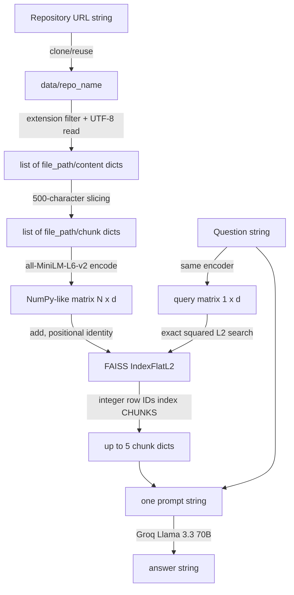

# 06 — Data Pipeline

## Why the data pipeline matters

Retrieval quality cannot exceed the quality of the artifacts created during ingestion. A perfect language model cannot recover a file silently skipped during decoding, a function split across arbitrary character boundaries, or a relevant chunk ranked outside the fixed top five. The pipeline must therefore be understood as a sequence of lossy transformations with explicit identity and dimensional invariants.

This chapter labels **current facts** and **recommended production design** separately.

## End-to-end lineage



The critical invariant is:

\[
\text{FAISS row } i \longleftrightarrow \texttt{pipeline["chunks"][i]}
\]

No IDs or metadata are stored in FAISS; list position is the only join key.

## Stage 1 — URL to local checkout

### Current implementation

`clone_repository` computes:

```text
repo_name = final URL segment with ".git" removed
repo_path = os.path.join("data", repo_name)
```

An existing path is immediately reused. Otherwise GitPython performs `Repo.clone_from`. The default clone is not shallow and no branch, tag, or commit is pinned.

### Why and tradeoffs

Cloning creates a local immutable-looking corpus that later stages can scan without repeated network calls. A full clone preserves history but the pipeline only reads the working tree, so history consumes time and disk without improving current retrieval. Reusing a directory reduces latency but sacrifices freshness and provenance.

### Edge and failure cases

- trailing slash makes the final segment empty and can target `data/`;
- URLs with query fragments produce awkward names;
- two hosts/owners with the same repository basename collide;
- `.replace(".git","")` removes that substring anywhere;
- private/authenticated repositories need credentials not modeled here;
- symlinks, submodules, Git LFS pointers, huge history, and malicious repositories are unrestricted;
- a canceled clone can leave an existing partial directory that future calls trust.

### Production recommendation

Parse and normalize the URL, allowlist protocols/hosts, derive a server-side repository ID, clone into a random temporary directory with depth/size/time constraints, resolve a commit SHA, verify success, and atomically publish. Store origin and commit as lineage metadata. Do not use user-derived filesystem paths as identity.

Use a shallow clone when only one revision is needed. Do not use it when history analysis, blame, tags, or commit-diff retrieval is required.

## Stage 2 — Checkout to source records

### Current implementation

`os.walk` recursively visits directories. A file is eligible only when its name ends exactly with:

```text
.py .js .ts .java .cpp .c
```

Each eligible file is read fully with UTF-8 into:

```json
{"file_path": "data/repo/app/api.py", "content": "..."}
```

A bare `except` silently drops any file that cannot be opened or decoded.

### Complexity and capacity

For \(F\) directory entries and total selected bytes \(B_s\):

- time: \(O(F+B_s)\);
- retained source memory: \(O(B_s)\);
- transient per-file string: \(O(|file|)\), then retained in the list.

The extension check costs \(O(6)\) suffix tests per file, effectively constant.

### Information lost

No language parser, MIME check, encoding detection, binary detection, ignore rules, file size, content hash, line map, revision, permissions, symlink status, or read-error record is retained. Unsupported formats such as `.tsx`, `.jsx`, `.go`, `.rs`, `.cs`, notebooks, SQL, Markdown, configuration, and templates are absent from retrieval.

### Production recommendation

Apply Git-aware ignore rules plus explicit include/exclude policy; skip `.git`, generated, vendor, secret, binary, and oversized files. Detect encoding conservatively. Record every skip reason. Use repository-relative POSIX paths, content hashes, language IDs, byte/line spans, and commit IDs.

Streaming file reads reduce peak memory, but parsers often need whole-file context. For small trusted repositories, whole-file reads are simpler and can be faster.

## Stage 3 — Source records to chunks

### Current implementation

For each source string of Python length \(L_i\), chunks start at offsets:

\[
0,500,1000,\ldots,500\left\lfloor\frac{L_i-1}{500}\right\rfloor
\]

The count is:

\[
N=\sum_{i:L_i>0}\left\lceil\frac{L_i}{500}\right\rceil
\]

Each chunk retains only `file_path` and substring. Python string slicing counts Unicode code points, not UTF-8 bytes, tokens, or lines. There is no overlap.

### Best, average, worst behavior

- **Best semantic case:** relevant concept is self-contained inside one 500-character region.
- **Average case:** partial declarations and nearby comments may still provide enough lexical signal.
- **Worst case:** a symbol, signature, call chain, or string literal crosses a boundary; neither half contains adequate meaning.

Time and copied text space are both \(O(B_s)\). The original full contents remain alive until handler completion, so peak memory includes both source and copied chunks.

### Example

```text
characters 0..499: function signature + first half
characters 500..999: second half + unrelated function
```

A question about the signature may retrieve the first chunk while omitting the return logic. Overlap would reduce boundary loss but duplicate tokens, vectors, and retrieval results.

### Production recommendation

Parse language structure with Tree-sitter or native ASTs; chunk by module/class/function and split oversized nodes by token-aware windows with overlap. Attach symbol, imports, line span, parent hierarchy, and neighboring IDs.

Alternatives:

- **Fixed token windows:** language-agnostic, predictable prompt cost; still split syntax.
- **Line windows:** easy citations; variable token size.
- **AST/symbol chunks:** coherent and citeable; parser maintenance and malformed-code fallback required.
- **Semantic chunking:** adapts to topic boundaries; expensive, nondeterministic, and often unnecessary for code.

Do not use tiny AST-only chunks when questions require cross-function flow; add parent/neighbor expansion or graph retrieval.

## Stage 4 — Chunks to embeddings

### Current implementation

`SentenceTransformer("all-MiniLM-L6-v2")` is a module singleton. `embed_chunks` extracts all chunk strings and calls `model.encode(texts)`. The model produces one dense vector per input; all-MiniLM-L6-v2 conventionally has \(d=384\), but the code discovers dimension from the first result instead of asserting it.

Sentence Transformers normally tokenize text, truncate to the model’s maximum sequence length, run the Transformer, pool token representations, and return floating-point sentence vectors. Model internals may vary by installed package/model revision; the repository does not pin versions or model revision.

Conceptually, mean pooling is:

\[
e=\frac{\sum_{t=1}^{T}m_t h_t}{\sum_{t=1}^{T}m_t}
\]

where \(h_t\) is a contextual token vector and \(m_t\) masks padding. Transformer self-attention per layer is approximately \(O(T^2d_h)\) in sequence length \(T\), while batching changes throughput, not asymptotic work.

### Current quality implications

- This is a general sentence model, not explicitly code-trained.
- Long 500-character chunks can still exceed token limits for symbol-heavy text and be truncated.
- Embeddings are not explicitly normalized.
- Paths, language, symbols, and line metadata are not included in embedding text.
- One call over all chunks lets the library batch internally but the application offers no bounded streaming or progress.

### Space

Embedding matrix storage is approximately:

\[
M_E=N\cdot d\cdot s
\]

where \(s\) is bytes per scalar, commonly 4 for float32. At \(N=1{,}000{,}000,d=384\), vectors alone are about 1.536 GB (1.43 GiB).

Peak memory also includes model weights, token batches, Python text, chunks, and another NumPy conversion during index build.

### Production recommendation

Pin model and library revisions, store `embedding_model_id` with each index, benchmark a code-aware model, normalize if cosine/IP is intended, batch by token budget, checkpoint outputs, and reject dimension/model mismatches. Cache vectors by `(model_id, content_hash)`.

Do not upgrade the embedding model in place: old and new vector spaces are not comparable. Build a new version and switch atomically.

## Stage 5 — Embeddings to vector index

### Current implementation

`IndexFlatL2(d)` stores every vector and performs exact exhaustive squared Euclidean search. `np.array(embeddings)` is added without an explicit dtype or contiguity assertion.

For database vector \(x_i\) and query \(q\):

\[
D_i=\lVert q-x_i\rVert_2^2=\sum_{j=1}^{d}(q_j-x_{ij})^2
\]

Lower is better. Squaring does not change rank relative to Euclidean distance.

Build/add time is \(O(Nd)\), index vector space \(O(Nd)\), and a query is \(O(Nd)\). Exact flat search has no approximation recall loss.

### Metric relationship

If vectors are unit normalized:

\[
\lVert q-x\rVert_2^2=2-2(q\cdot x)
\]

Thus L2 ranking equals cosine ranking. The code does not normalize explicitly, so vector norm can affect rank.

### Production recommendation

Keep flat exact search for small corpora and as a recall ground truth. For larger corpora consider:

- **HNSW:** strong low-latency recall, \(O(NM)\) graph space, expensive build, deletion complexity.
- **IVF:** probes selected clusters; compact and fast, but needs training and tuning (`nlist`, `nprobe`).
- **Product quantization:** major memory reduction, but distance error hurts recall.
- **Managed vector DB:** persistence/filtering/replication; network, vendor, cost, and consistency overhead.

Select using measured recall@k, p95 latency, memory, ingest rate, and filter behavior—not repository size labels alone.

## Stage 6 — Index publication and summary

### Current implementation

Chunks and index are stored in the global dictionary before summary generation. Summary then performs another full walk:

- `total_files`: all directory files, including `.git`;
- `languages`: set converted to list, so response ordering is not guaranteed;
- `main_modules`: first five encountered `.py` basenames;
- `total_chunks`: chunk-list length.

If summary fails, index/chunks may already be visible. There is no durable serialization.

### Production recommendation

Create an immutable manifest:

```json
{
  "repository_id": "r_123",
  "commit": "abc...",
  "chunk_schema": 2,
  "embedding_model": "model@revision",
  "dimension": 384,
  "metric": "cosine",
  "chunk_count": 123,
  "artifact_checksums": {}
}
```

Publish one manifest pointer only after all artifacts verify. Summary should derive from the same selected-file inventory to avoid inconsistent counts.

## Stage 7 — Question to retrieved context

### Current implementation

The question is embedded using the same model into shape `(1,d)`. FAISS returns distances and row indices, but the retriever discards distances and takes exactly the first row. It appends `chunks[idx]` for every returned index.

Time is \(O(Nd+k)\), output references \(O(k)\), with \(k=5\). No filter, threshold, deduplication, reranking, query expansion, hybrid lexical search, or neighboring chunk expansion exists.

### Edge cases

- \(N<k\): invalid `-1` labels can map to the last Python list element.
- Empty question: still produces an embedding and arbitrary nearest results.
- Question asks for exact symbol: semantic embeddings may underperform lexical search.
- Relevant evidence spans more than five chunks.
- Duplicate boilerplate crowds out diverse evidence.
- Index and chunk list versions can mismatch.

### Production recommendation

Validate nonempty queries; set \(k'=\min(k,N)\); discard negative IDs; retain scores; apply repository/version filters; combine BM25/symbol search and vector results with reciprocal-rank fusion; rerank a larger candidate set; diversify; add neighboring/parent chunks; enforce a prompt token budget; return citations and retrieval diagnostics.

Hybrid retrieval costs more CPU/storage but is usually stronger for code identifiers. Do not add a cross-encoder reranker when latency is strict and flat retrieval already meets measured quality.

## Stage 8 — Context to answer

### Current implementation

Retrieved chunks become:

```text
File: <path>
<chunk>

File: <path>
<chunk>
...
```

That text and the question are interpolated into one user message. The only instruction asks for a clear explanation of the responsible file/module. Code content can contain prompt-like text; it is not delimited as untrusted data. The first Groq choice is returned.

### Risks and limits

- prompt injection from repository content;
- no source citations or uncertainty requirement;
- arbitrary path exposure;
- provider context limit failures;
- cost and latency grow with context/output tokens;
- no redaction of secrets that entered chunks;
- low temperature reduces variance but does not establish factuality.

### Production recommendation

Treat code as untrusted quoted context, use a system policy, number chunks, require claim-to-chunk citations, cap tokens, redact secrets, and say when evidence is insufficient. Validate/sanitize output. Log metadata rather than raw proprietary code where possible.

## Observability and data-quality gates

Recommended stage metrics:

```text
clone_seconds, checkout_bytes, selected/skipped_files_by_reason
chunk_count, chunk_token_histogram, parse_fallback_rate
embedding_seconds, batch_tokens, cache_hit_rate
index_bytes, build_seconds, ntotal, dimension
retrieval_seconds, score_distribution, recall@k on eval set
provider_seconds, input/output_tokens, errors_by_code
```

Quality gates should assert nonempty inventory, unique IDs, valid spans, finite float vectors, expected dimension/dtype, `index.ntotal == len(chunks)`, load/search smoke tests, and manifest checksums.

## Interview — Beginner

**Question:** What is the main invariant connecting FAISS results to code?

**Ideal Answer:** FAISS row `i` must refer to chunk-list element `i`; the implementation has no stored document IDs.

**Why interviewer asked it:** To test whether the candidate understands vector metadata joins.

**Common mistakes:** Claiming FAISS stores file paths; confusing vector dimension with row ID.

**Follow-up questions:** How would explicit IDs improve versioning? What breaks if chunks are reordered?

## Interview — Intermediate

**Question:** Why is 500-character chunking weak for source code?

**Ideal Answer:** It ignores tokens, syntax, symbols, and boundaries, so related logic can be split and unrelated logic combined. It also lacks overlap and line metadata for reconstruction and citations.

**Why interviewer asked it:** To assess retrieval-quality reasoning upstream of the LLM.

**Common mistakes:** Treating characters as tokens; proposing huge chunks without considering model limits.

**Follow-up questions:** Compare AST chunks and token windows. How would malformed code be handled?

## Interview — Advanced

**Question:** How would you migrate to a new embedding model without downtime?

**Ideal Answer:** Version chunks and indexes by model/revision, backfill a separate index, validate dimensions and offline recall, dual-read or shadow traffic, atomically switch the repository manifest, and retain rollback artifacts.

**Why interviewer asked it:** To test vector-space compatibility and operational migration.

**Common mistakes:** Mixing vectors from both models; overwriting the live index incrementally.

**Follow-up questions:** When can cached chunks be reused? How do you compare ranking quality?

## Interview — FAANG

**Question:** Design retrieval for billion-scale multi-tenant code chunks.

**Ideal Answer:** Partition by tenant/repository and version, use immutable content-addressed chunks, hybrid lexical/vector candidates, ANN with filter-aware sharding, rerank bounded candidates, cache by query/model/version, enforce tenant quotas, replicate hot shards, and evaluate recall/latency/cost continuously.

**Why interviewer asked it:** To test scale, isolation, relevance, and operability together.

**Common mistakes:** One global HNSW index; post-filtering that returns too few tenant results; ignoring re-embedding cost.

**Follow-up questions:** Choose shard keys. Handle hot repositories. Restore a corrupt shard.

## Interview — Follow-up

**Question:** Why can the summary report more files than ingestion processed?

**Ideal Answer:** Summary counts every file, including `.git` and unsupported files, while ingestion selects six extensions and silently skips unreadable files.

**Why interviewer asked it:** To test lineage consistency and metric semantics.

**Common mistakes:** Assuming `total_files` means indexed files; overlooking silent decode failures.

**Follow-up questions:** Which inventory should be authoritative? How should skipped files appear?

## Interview — Trick

**Question:** If FAISS is asked for five neighbors from a three-vector index, will Python necessarily raise an index error?

**Ideal Answer:** No. FAISS may return `-1` placeholders, and Python `chunks[-1]` validly selects the last chunk, causing silent duplicate/wrong context.

**Why interviewer asked it:** To probe boundary behavior across library and language semantics.

**Common mistakes:** Assuming the library always returns only three rows; assuming negative indices are invalid in Python.

**Follow-up questions:** What validation should surround search results? Which test catches this?
